# Clarion Template Maker

Tooling to make Claude a **Clarion 12 template authoring professional** — for creating and editing the
`.tpl`/`.tpw` files that drive Clarion's Application Generator (AppGen).

This was built by studying the installed Clarion 12 template corpus:
- Shipped ABC + classic templates — `C:\clarion12\template\win\` (160 `.tpl`, 626 `.tpw`)
- Third-party / accessory templates — `C:\clarion12\accessory\template\win\` (AJE*, CapeSoft AnyFont/
  AnyText, ChromeExplorer, HotDates, KeepingTabs, Cryptonite, …)
- Official docs — `C:\clarion12\docs\TemplateLanguageReference.pdf`, `TemplateGuide.pdf`

## What was created

### 1. Skill — `clarion-template`
Location: `~/.claude/skills/clarion-template/`

A reusable knowledge pack Claude loads when working on any `.tpl`/`.tpw` file:
- `SKILL.md` — file types, the three-rule mental model (directive vs. literal, `#!` vs `!`,
  parse-time vs generate-time), the 80%-case extension skeleton, authoring workflow, correctness rules.
- `reference/directives.md` — full directive vocabulary (`#TEMPLATE`/`#PROCEDURE`/`#CONTROL`/
  `#EXTENSION`/`#CODE`/`#GROUP`, the `#PROMPT`/`#SHEET`/`#TAB`/`#BOXED` UI set, `%Symbol` state,
  control flow, `#AT`/`#EMBED` injection, `#GENERATE`/`#CREATE`/`#INSERT`) with real signatures.
- `reference/patterns.md` — the playbook: disable switch, multi-DLL externals + export lists, `ONCE`
  includes, Init/Kill lifecycle, multi-instance naming, `#GROUP` reuse, project files, custom embeds.
- `reference/examples.md` — three complete annotated templates (a procedure extension, an application
  extension, a value-returning group) plus a verification checklist.

### 2. Agent — `clarion-template-pro`
Location: `~/.claude/agents/clarion-template-pro.md`

A specialist subagent trained on the above. Use it for any template task — writing a new
procedure/control/extension/code/group template, modifying or debugging an existing one, explaining
directives, or designing the AppGen prompt UI and embed wiring. It reads the skill references and the
shipped corpus before writing, respects the parse-time/generate-time model, and predicts the generated
Clarion source so you know exactly what to verify.

## Repo layout

```
skills/clarion-template/        # the skill (SKILL.md + reference/)
agents/clarion-template-pro.md  # the specialist subagent
templates/                      # ready-to-register Clarion templates
  myPixel.tpl                   #   per-window diagnostic pixel (see below)
  showLine.tpl                  #   Ctrl+Shift+P "where am I" hotkey (see below)
  identifier.tpl                #   Ctrl+Shift+I shows the procedure name
  myFuncs/                      #   global function library (see below)
    myFuncs.tpl                 #     self-contained: prototypes + bodies in one template
  myPie/                        #   pie chart for a window (see below)
    myPie.tpl                   #     global helper + procedure extension
  myFontChanger/                #   global + per-list font picker (see below)
    myFontChanger.tpl
  myBackground/                 #   global default + per-window background color/image (see below)
    myBackground.tpl
  myQR/                         #   QR code into an image control, auto-refresh (see below)
    myQR.tpl
  myImage/                     #   12 image formats in, 9 out, every colour format (see below)
  myGauge/                      #   analog gauge/dial on windows and reports (see below)
    GaugeClass.inc              #     the gauge class (config + method prototypes)
    GaugeClass.clw              #     the implementation (geometry + native drawing)
    myGauge.tpl                 #     global include + window + report extensions
  graficaBarra/                 #   13 chart types on windows and reports, vector on PDF (see below)
    GraficaBarraClass.inc       #     the bar-graph class (config + method prototypes)
    GraficaBarraClass.clw       #     the implementation (scale + BOX/LINE/SHOW drawing)
    graficaBarra.tpl            #     global include + window + report extensions
    graficaBarra.zip            #     the three files above, zipped for easy distribution
  myGaugePlus/                  #   ANTIALIASED (GDI+) gauge/dial on windows (see below)
    gpcanvas.c                  #     GDI+ flat-API shim (bound at runtime, compiled by Clacpp)
    AaCanvasClass.inc/.clw      #     reusable antialiased 2D canvas over GDI+
    GaugePlusClass.inc/.clw     #     the pretty gauge, drawn on the canvas
    myGaugePlus.tpl             #     global include + window + control template
  myCompress/                   #   pure-Clarion compression: DEFLATE/zlib/gzip (see below)
    CompressClass.inc           #     the codec class (config + method prototypes)
    CompressClass.clw           #     the implementation (inflate/deflate/containers)
    CompressClassC.inc          #     optional C-backed subclass (the fast engine)
    CompressClassC.clw          #     overrides Wrap/Unwrap to call mc.c
    mc.c                        #     our own DEFLATE in C (compiled by Clarion's Clacpp)
    myCompress.tpl              #     one global extension (engine prompt: Clarion / C)
  myPdfSign/                    #   pure-Clarion signed-PDF reader: who signed it (see below)
    PdfSignClass.inc            #     the reader class (config + method prototypes)
    PdfSignClass.clw            #     the implementation (PDF parse + PKCS#7/DER walk)
    myPdfSign.tpl               #     one global extension (the shared object)
  myCalc/                       #   pop-up calculator beside a numeric field (see below)
    CalcClass.inc               #     the calculator (4 modes, tape, EN/ES strings)
    CalcClass.clw               #     the implementation (keypad, arithmetic, window)
    calc16.ico                  #     the little calculator on the button
    myCalc.tpl                  #     global extension + button control + code template
    myCalc.zip                  #     the four files above, zipped for easy distribution
  myFilter/                     #   build filters for any browse (see below)
    MyFilterClass.inc           #     the filter builder (fields, operators, EN/ES)
    MyFilterClass.clw           #     the implementation (expressions + the window)
    myFilter.tpl                #     global extension + browse button + code template
    FilterTables.txt            #     table structures, if saved filters are shared
  myCalendar/                   #   pop-up date picker beside a date field (see below)
    MyCalendarClass.inc         #     the calendar (views, range, EN/ES strings)
    MyCalendarClass.clw         #     the implementation (date maths, drawing, window)
    cal16.ico                   #     the little calendar on the button
    myCalendar.tpl              #     global extension + button control + code template
    myCalendar.zip              #     the four files above, zipped for easy distribution
  myExport/                     #   export any browse/list to 7 file formats (see below)
    ExportClass.inc             #     the export engine (config + method prototypes)
    ExportClass.clw             #     the implementation (dialog + 7 writers + ZIP + UTF-8)
    myExport.tpl                #     global extension + Export-button control + code template
    myExport.zip                #     the three files above, zipped for easy distribution
  myHook/                       #   intercept MESSAGE / STOP / HALT / errors (see below)
    MsgHookClass.inc            #     the interceptor (rules, log, the seven RTL hooks)
    MsgHookClass.clw            #     the implementation (hook thunks + append-only logger)
    myHook.tpl                  #     global extension + per-procedure pause + code template
    myHook.zip                  #     the three files above, zipped for easy distribution
designer/ClarionTplDesigner/    # WPF visual designer for the prompt UI (see below)
installer/                      # builds the installer + a portable single-file exe
README.md
```

## Included templates

### `templates/myPixel.tpl` — per-window diagnostic pixel
A global (APPLICATION-scope) ABC extension that needs no per-procedure setup. On **every** procedure
that owns a window it drops a tiny configurable REGION "pixel" in the top-left corner. Hovering it shows
a tooltip with the **procedure name**, the current **thread number**, and the **binary** the procedure
lives in (app/EXE or DLL). Pressing **Ctrl+Shift+I** pops a message box with the same information.

- Prompts: master disable, pixel fill color, pixel size, and a Ctrl+Shift+I hotkey toggle.
- Implementation: a self-contained `CASE EVENT()` injected at the top of `WindowManager.TakeWindowEvent`
  (PRIORITY 2000, before the framework's CYCLE/BREAK loop), creating the control on `EVENT:OpenWindow`
  and answering `EVENT:AlertKey`. Local-only code — no globals, so no multi-DLL handling needed.
- Register it like any template (see below), then add **myPixel - Diagnostic Pixel (Global)** under
  Global → Extensions.

### `templates/showLine.tpl` — Ctrl+Shift+P "where am I" hotkey
A global (APPLICATION-scope) ABC extension that needs no per-procedure setup. On **every** windowed
procedure it alerts **Ctrl+Shift+P**; pressing it pops a message telling you where you are: the
**procedure** (the code you're in), the **control with focus** (its field number and USE variable), the
**thread number**, and the host **binary** (EXE/DLL).

- Prompts: master disable, a toggle to include the focused-control details, and a custom message title.
- Implementation: a self-contained `CASE EVENT()` injected at the top of `WindowManager.TakeWindowEvent`
  (PRIORITY 2000); `ALERT(CtrlShiftP)` on `EVENT:OpenWindow`, and on `EVENT:AlertKey` it reads `FOCUS()`
  and `feq{PROP:Use}` to report the live focus. Local-only code — no globals, so no multi-DLL handling.
- Register it, then add **showLine - Where-Am-I Hotkey (Global)** under Global → Extensions.

### `templates/identifier.tpl` — Ctrl+Shift+I shows the procedure name
A global (APPLICATION-scope) ABC extension, no per-procedure setup. It alerts **Ctrl+Shift+I** on every
windowed procedure; pressing it pops a message box with the current **procedure name** (baked in at
generation time via `%Procedure`). Same proven injection as the other hotkey templates (self-contained
`CASE EVENT()` at the top of `WindowManager.TakeWindowEvent`). Register it and add **identifier - Show
Procedure Name (Ctrl+Shift+I)** under Global → Extensions.

### `templates/myFuncs/` — global function library
A global (APPLICATION-scope) ABC extension that makes a growing set of utility **functions** callable
from anywhere in the app, with no per-procedure setup and **no external source files**. The template
is self-contained: it adds each prototype **bare** to the program's global `MAP` (`#AT(%GlobalMap)`)
and writes each function **body into the program module itself** (`#AT(%ProgramProcedures)`). Prototype
and body in the same module is the simplest, always-valid Clarion structure. Grow the library by adding
one prototype line and one body to `myFuncs.tpl` — nothing else to wire.

**Functions provided** (both take an omittable date that defaults to today):
- **`weekNumber(<date>),LONG`** — **ISO‑8601 (European)** week number. Weeks start Monday; week 1 is the
  week containing the year's first Thursday (the week with Jan 4). Early‑January dates can fall in week
  52/53 of the *prior* year.
- **`weekNumberUS(<date>),LONG`** — **US / North‑American** week number. Weeks start Sunday; week 1 is the
  week containing January 1st, so Jan 1 is always in week 1.

```clarion
wk  = weekNumber()              ! this week's ISO number
wk2 = weekNumber(myOrder:Date)  ! ISO week of a specific date
us  = weekNumberUS(myOrder:Date)! US week of the same date (can differ by one)
```

Install: register `myFuncs.tpl`, then add **myFuncs - Global Function Library (Global)** under
Global → Extensions, generate, and build. (No source files to copy — everything is generated.)

### `templates/myPie/` — pie chart on a window
Renders a pie chart into an IMAGE control using Clarion's built-in `PIE` graphics primitive (no external
files). **Easiest path: a control template** — drag **myPie - Pie Chart** straight onto a window and it
drops the IMAGE *and* wires the pie + legend in one go, fully self-contained (no global/procedure extension
needed). Drop several on one window. Or use the two-extension route for an existing IMAGE control. Four
registrations in all:
- **`myPieControl`** (CONTROL) — the drag-on pie. Set the 3D depth, background, legend/percentages, and the
  segments (label / relative **value** / **color**); each control owns its own data (keyed off its **Image
  control**, so there are no names to keep in sync) and redraws on open/resize. The segments **seed a runtime
  `QUEUE`** (`<Image>:Q`, fields `QLabel`/`QValue`/`QColor`) — so the slice count is **unbounded** at run
  time, not fixed at generation. The redraw rebuilds the `PIE()` arrays (fixed `DIM(64)` buffers; a 0-value
  slice is an invisible 0° wedge) and walks the queue for the legend. Depth / legend / percentages are
  **run-time variables** so a panel can change them live.
- **`myPiePanel`** (CONTROL, **MULTI**) — a drag-on **live control panel**: a 3D-depth field, show-legend and
  show-percentages **toggle buttons**, and an **editable slice list with Add / Edit / Delete**. Link it by
  **picking the pie's Image control** (a drop-list — no typed names). The list shows every slice; **Add**,
  **Edit** (or **double-click** a row), and **Delete** edit them through a small **modal popup** (Label /
  Value / **Color** via the color dialog) — so you are no longer capped at a handful of slices. Every change
  repaints the pie **live**. **Drop one panel per pie** on the same window — it's multi-instance: the on-window
  controls are field-equates (auto-uniqued, captured in `#ATSTART`) and the per-instance data (the modal +
  its fields) is keyed by `%ActiveTemplateInstance`, so panels never collide. (Editing is plain queue + modal
  Clarion — no `QEIPManager`/EIP classes, which proved unstable as a standalone in-cell editor.)
- **`myPieGlobal`** (APPLICATION) — adds the global helper `myPieDraw(window, imageFeq, slices[], colors[],
  …)` to the program module. Add once, globally (only needed for the procedure-extension route).
- **`myPie`** (PROCEDURE) — drop on a window procedure; pick a sized **IMAGE control**, set 3D depth /
  background, and define the segments. Draws the pie plus a **legend** (swatch + label + **percentage**),
  redraws on **resize**, and exposes a **`myPieRepaint`** routine.

`PIE` (`builtins.clw:1402`) takes a SIGNED array of relative slice sizes and a LONG array of colors and
draws the whole chart in one call. The drawing uses **`SETTARGET(window, ?image)`** so the IMAGE itself is
the target (origin `0,0`, the graphics belong to the control and survive a repaint/resize, and a `BLANK`
clears only that image) — the same model as myGauge, so multiple pies never erase each other.

Install: register `myPie.tpl`, then either drop **myPie - Pie Chart** from the control toolbox, or add
**myPie - Global Helper** (Global → Extensions) + the **myPie** procedure extension on a window. **Upgrade
note:** the `myPieDraw` helper gained a leading `WINDOW` parameter, so **regenerate** any app built against
the older one (a stale call shows as "No matching prototype available").

### `templates/myFontChanger/` — global + per-list font picker
A single global (APPLICATION-scope) ABC extension, no per-procedure setup:
- Applies a **default font** (name + size) to every browse/`LIST` control at window open.
- **Right-click any list** at run time for a popup menu (**Change Font…** → the Windows font dialog, or
  **Reset to Default Font**).
- With a list focused, **Ctrl+Plus / Ctrl+Minus** change its font size up/down by **1 point** and save it.
- Saves each list's choice in **its own INI section** (`[Procedure_Control]`, with Name/Size/Color/Style)
  and re-applies it on reopen — a stored per-list font overrides the global default; reset reverts to it.

It adds two helpers to the program module (`myFontApply`, `myFontChange`) and injects into
`WindowManager.TakeWindowEvent` (apply fonts + arm the right-click on `EVENT:OpenWindow`) and
`TakeFieldEvent` (list events arrive there with `FIELD()` = the list). Uses `SETFONT`, `FONTDIALOG`,
`GETINI`/`PUTINI`, and armed-key alerts (`MouseRightUp` for the menu, `CtrlPlus`/`CtrlMinus` for sizing).
The extension has a **General** tab (default font, size, INI name) and an **Instructions** tab.
Register it, add **myFontChanger - global per-list font picker** under Global → Extensions, set the
default font + INI name, generate and build.

### `templates/myBackground/` — global default + per-window background color / image
A single global (APPLICATION-scope) ABC extension, no per-procedure setup:
- Gives **every window** a **global default background** — a solid **color** and/or an **image** — applied
  automatically at window open.
- Press **Ctrl+Shift+B** on any window for a small chooser: **Background Color…** (color dialog),
  **Background Image…** (file dialog, stretched to fill), or **Use Default** (drop this window's
  personal setting and revert to the global default).
- Saves each window's choice in **its own INI section** (`[Procedure]`, with `Mode`/`Color`/`Image`) and
  re-applies it on reopen — a stored personal background **overrides** the global default.

It adds two helpers to the program module (`myBackApply`, `myBackChoose`) and injects into
`WindowManager.TakeWindowEvent` (apply the background + arm the hotkey on `EVENT:OpenWindow`; pop the
chooser on `EVENT:AlertKey`). At run time a solid color is set with `0{PROP:Color}` and an image with
`0{PROP:WallPaper}` (with `PROP:Tiled`/`PROP:Centered` off so it stretches to fill); uses `COLORDIALOG`,
`FILEDIALOG`, `GETINI`/`PUTINI`, and an armed `Ctrl+Shift+B` alert. The extension has a **General** tab
(default color, default image, INI name, hotkey toggle) and an **Instructions** tab. Register it, add
**myBackground - per-window background color / image** under Global → Extensions, set your defaults +
INI name, generate and build. Full programmer's documentation (prompts, generated code, embed points,
the `myBackApply`/`myBackChoose` helper API, and the runtime properties it uses) is in
[`docs/myBackground-template.html`](docs/myBackground-template.html).

### `templates/myQR/` — QR code into an image control
A self-contained ABC **procedure** extension that renders a **QR code** into an `IMAGE` control on a window.
The QR **value** can be a design-time **literal** (a quoted string) **or any Clarion variable/expression** you
change in code (e.g. `Cus:Email`, `loc:URL`) — it's emitted verbatim, so it's read at run time. With
**auto-refresh** on, a window timer watches the value and reloads the QR whenever it changes; you can also
force a redraw anytime with `DO myQRRefresh`. Prompts: image control, value, size, error-correction (L/M/Q/H),
quiet-zone margin, and the auto-refresh toggle/poll.

Since Clarion has no built-in QR encoder, the PNG is fetched from the free public web service
**`api.qrserver.com`** (goqr.me) and loaded into the image with `feq{PROP:Text}=file`. The download uses
**`curl.exe`** (ships with Windows 10/11), launched **hidden and synchronously** via `CreateProcessA` +
`WaitForSingleObject` (no console flash; the PNG is on disk before the image loads). It's self-contained (a
URL-encoder + a download/load helper in the program module; no external `.inc`/`.clw`). **Privacy/internet
caveat:** the value is sent over HTTPS to that third-party service every render and an internet connection is
required — don't encode secrets, or repoint the helper at your own QR endpoint / a local library for
offline use. Register it, add **myQR - QR code into an image control** to a window procedure's Extensions,
pick a sized IMAGE control, set the value, generate and build. Full programmer's documentation (prompts,
the literal-vs-code value, generated code, the `myQRLoad`/`myQRUrlEncode`/`myQRRefresh` API, the curl/
CreateProcess download, and the privacy caveat) is in [`docs/myQR-template.html`](docs/myQR-template.html).

### `templates/myQRDraw/` — offline QR code drawn with BOX primitives
The **offline** companion to myQR: instead of downloading a PNG, it carries a complete **QR encoder** and
draws every module as a filled `BOX` into an `IMAGE` control — exactly the way myPie draws a pie. **No
internet, no `curl`, no temp files.** The window `Draw` renders in **pixel units** (`0{PROP:Pixels}`), so
adjacent module boxes abut on exact pixel boundaries — no dialog-unit rounding leaves thin white seams
between modules (and it stays crisp across repaints; the report path keeps report units). The window
`Draw` targets the image with the **two-argument `SETTARGET(Window, ?Image)`**, so its `BLANK` is clipped to
the image rectangle and the modules paint from a `0,0` origin — several QR codes on one window no longer erase
each other, and `Draw` also accepts a plain `STRING` value, not only a `CSTRING`. A **global** extension adds the encoder + the `QRDraw()` helper (add
once per app); a **procedure** extension wires it to a window, redrawing on open/resize. The value can be a
design-time **literal** or any **Clarion variable/expression** (change it and `DO myQRDrawRepaint`). Prompts:
image control, value, ECC level (L/M/Q/H), dark/light colors, quiet-zone width, and a **self-test** that
draws a fixed `HELLO WORLD` symbol so you can confirm the encoder works by scanning it.

**Reports** render bands through the print engine, not window events, so a separate **myQRDrawReport**
extension handles them: drop an IMAGE control in the detail band, add the extension, and a code is drawn
**per record** in the *Before-Print-Detail* embed via `SETTARGET(Report)` (the window extension and the
report extension share the same encoder and `QRPaint()` drawing — only the draw target and timing differ).

The encoder (byte mode, **versions 1–10**, automatic version + mask) is a line-for-line port of the
ZXing-validated C# reference in [`designer/QrCodeCore/`](designer/QrCodeCore/); its exact `HELLO WORLD`/ECC-M
matrix is pinned by a golden test, and that is the same symbol the self-test draws. The encoder ships as a
self-contained Clarion **class** — `QRCodeClass.inc` + `QRCodeClass.clw` (stored in **ANSI**) — so it compiles
in its own module instead of filling the program's global procedure area; the global extension just
`INCLUDE`s it and declares one `QRCodeObj` instance. Copy the two class files to a folder on the Clarion
redirection path (your app folder or `\clarion12\libsrc\win`). Choose myQRDraw for kiosks, point-of-sale,
field laptops, air-gapped networks, and reports that must render with zero external dependencies; choose myQR
when an internet round-trip is acceptable. Full programmer's documentation is in
[`docs/myQRDraw-template.html`](docs/myQRDraw-template.html).

### `templates/myBarcodeGen/` — nine barcode types, offline, drawn with BOX primitives
A generalization of myQRDraw to **nine symbologies**: the **linear (1D)** codes **Code 39, Code 128**
(auto Code B / Code C), **Interleaved 2 of 5, EAN-13, UPC-A**, and the **2D** codes **QR, Data Matrix,
PDF417, Aztec**. Same offline approach — encode at run time, draw with `BOX`es (1D = full-height bars +
optional human-readable text; 2D = a module/stacked grid). As in myQRDraw, every window `Draw` renders in
**pixel units** (`0{PROP:Pixels}`) so modules/bars abut on exact pixel boundaries — no dialog-unit rounding
leaves thin white seams (the report path keeps report units). Pick the **Barcode type** from a drop-list; the
rest is like myQRDraw (value literal-or-variable, colors, quiet zone), with **window** and **report**
extensions. Each encoder is a self-contained ANSI Clarion class, ported from the ZXing-validated C# reference
[`designer/BarcodeCore/`](designer/BarcodeCore/) (**42 round-trip tests**): `BarcodeClass` (1D),
`QRCodeClass`, `DataMatrixClass` (ECC200), `Pdf417Class` (GF(929) + a packed pattern table), and `AztecClass`
(variable Galois field, bullseye + spiral). Copy the five encoder classes (ten `.inc`/`.clw` files) to the
Clarion redirection path. Reed–Solomon spans four different fields across the set (GF(256) poly 0x11D/0x12D,
the prime field GF(929), and GF(2^n) for Aztec). Full **developer's manual** (install, the class APIs, per-
symbology rules, drawing model, multi-DLL, troubleshooting) is in
[`docs/myBarcodeGen-template.html`](docs/myBarcodeGen-template.html).

### `templates/myImage/` — **twelve image formats in, nine out**, every colour format
Read **BMP, GIF, JPEG, PNG, TIFF, ICO, EMF, WMF, TGA, PCX, PNM and QOI**; write **BMP, GIF, JPEG, PNG,
TIFF, TGA, PCX, PNM and QOI**. Convert between **every colour format** — 32-bit ARGB, 24-bit RGB,
16-bit 5-6-5, 15-bit 5-5-5, 256 and 16 colours (median-cut palette, optional Floyd–Steinberg dither),
256 / 16 / 4 greys, 1-bit black & white and the web-safe 216. Transform on the way through: rotate
90/180/270 or **any angle**, mirror, flip, crop, extend the canvas, resize (nearest / bilinear /
area-average) and fit — stretch, proportional, cover, centred, contain. Adjust brightness, contrast,
saturation, gamma, levels, blur, sharpen, invert, sepia, posterise, alpha flatten, opacity; read a luma
histogram and the generated palette.

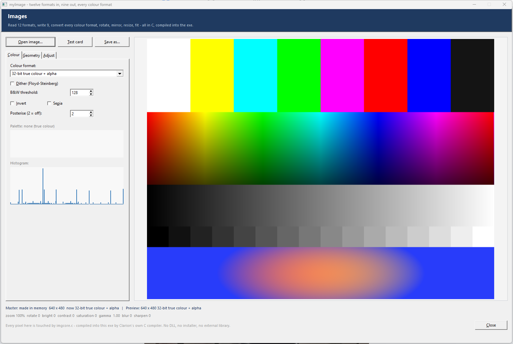

**It is fast because the pixel work is C.** `imgcore.c` is compiled straight into your exe by Clarion's
own C compiler (`PRAGMA('compile(imgcore.c)')`) — there is no DLL to ship and nothing to install. The
formats Windows already owns are decoded through **GDI+** (part of Windows, bound at run time, so no
import library either); everything else — the TGA/PCX/PNM/QOI/BMP codecs, the quantiser, the dithering,
every resample and every adjustment — is plain C in that one file. The engine deliberately uses **no C
runtime and no libm**: memory comes from `LocalAlloc`, files from `CreateFileA`, and anything needing
`sin`/`cos`/`pow` is worked out on the Clarion side and handed over (free rotation takes a cosine and a
sine; gamma and levels arrive as a 256-entry lookup table). That is why it compiles with Clacpp
everywhere, unchanged.

Every colour format, converted from the built-in test card — note the dithering doing its work at 16
colours and at 1 bit, and the banding you would expect at 16- and 15-bit:

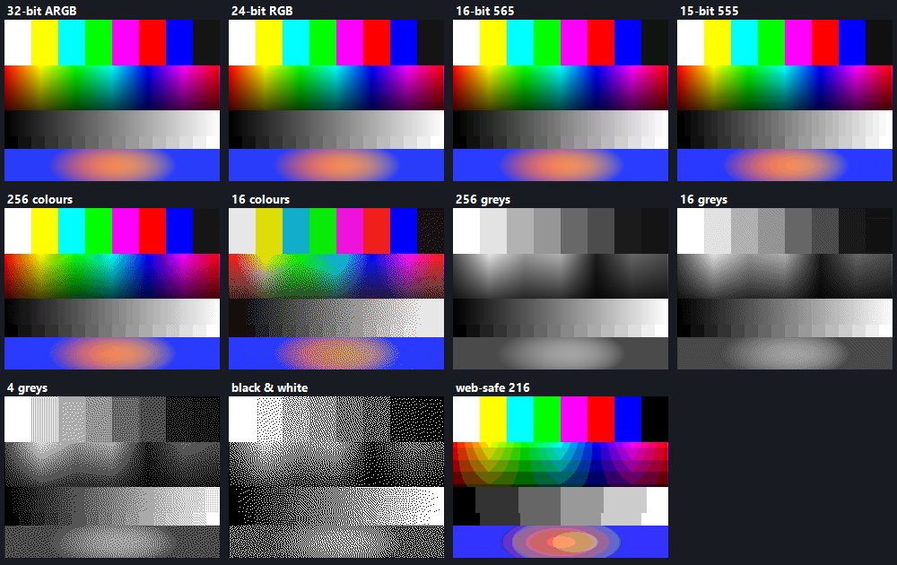

**Two drop-on controls, if you would rather not touch the extension at all.** Drop **myImage - Image view**
on a window and you have a working image; drop **myImage - Image tools panel** beside it, point it at the
view's IMAGE control, and you get open / save / turn / mirror / flip / zoom / fit / reset, a colour-format
list and the effects — wired up, with nothing to type on both sides:

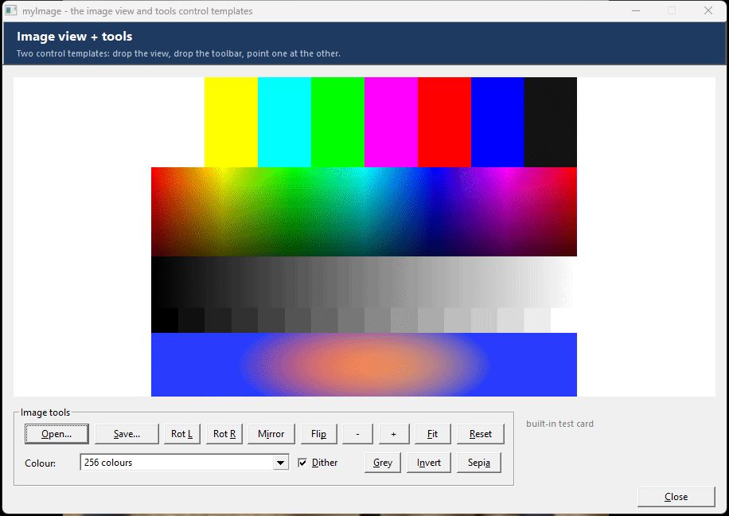

The two find each other through the view's **IMAGE control field equate** — the view names everything it
declares after it, and the panel derives the same names from the same control. Nothing to keep in step, and
several views on one window never collide. The view keeps a **master** copy and a **working** copy, so
switching 256 colours → black & white → back to 24-bit costs nothing: each conversion starts again from the
master instead of eating into what is left.

Five registrations: **myImageGlobal** (include the class once), **myImageView** + **myImageTools** (the two
control templates above), **myImage** (a procedure extension —
an image object bound to an `IMAGE` control, with generated `Refresh:` and `Show:` routines, and prompts
for the whole recipe: load, rotate, resize, adjust, convert, save), and **myImageConvert** (a *code*
template — drop it in any embed to convert one file into another format, colour format and size in a
single statement). All of it is also just a class, so you can drive it from code:

```clarion
IF Pic.LoadFile('holiday.jpg')
  Pic.Fit(1024, 768, Img:Contain)      ! keep the ratio, no padding
  Pic.Convert(Img:Pal256, 1)           ! 256 colours, dithered
  Pic.SaveFile('holiday.gif')          ! or .png .bmp .tif .tga .pcx .ppm .qoi
  Pic.Draw(MyWindow, ?Preview)         ! and show it, fitted to the control
END
```

Copy `ImageClass.inc` + `ImageClass.clw` + `imgcore.c` to the redirection path —
[`myImage.zip`](templates/myImage/myImage.zip) bundles all four files. Full bilingual (English +
Spanish) documentation — prompts, the class API, every format and colour format, how the engine is put
together, and troubleshooting — is in
[`docs/myImage-template.html`](docs/myImage-template.html). `examples/myImage/` has
**ImageDemo** (open anything, push it through every conversion and transform, watch the histogram and
palette update, save it back out) and **ImgTest**, a headless harness that round-trips all nine writable
formats and all eleven colour formats and writes the results to an INI.

### `templates/myGauge/` — analog gauges/dials on windows and reports
A configurable **analog gauge** drawn entirely with native Clarion graphics (`ARC`, `ELLIPSE`, `LINE`,
`POLYGON`, `SHOW`) into an `IMAGE` control — the same offline, no-dependency approach as myPie and myQRDraw.
A single self-contained ANSI class, **`GaugeClass`**, holds the configuration (range, span, colors, ticks,
zones) and renders itself; each gauge on a window is its **own local object**, so multiple dials per window
or report just work. **Easiest path: a control template** — drag **myGauge - Analog Gauge** straight onto a
window and it drops the IMAGE *and* wires the gauge in one go, fully self-contained (it `INCLUDE`s the class
itself, so no global extension is needed). Pick an **arc style** — 45°, 90°, 180°, 270° (speedometer), 360°,
or a **custom** start + signed sweep — set the **min/max range**, then drive the needle from a **literal** or
any **variable/field**.
Configurable everything: major/minor **ticks** with numeric labels, a digital **value readout**, **title/units**
text, a **triangle or line needle**, face/rim/track/tick/text colors, up to 16 colored **zones** (e.g. green
0–60 / amber 60–85 / red 85–100), and **smooth needle animation** via the window timer (`AnimateTo` +
`AnimStep`). Four registrations: the **myGaugeControl** control template (drag-on, self-contained) plus three
extensions — **myGaugeGlobal** (include the class once), **myGauge** for **windows** (redraw
on open/resize, optional animation, a generated `Refresh:<Object>` routine), and **myGaugeReport** for
**reports** (a gauge per record, drawn at `%BeforePrint` under `SETTARGET(Report)`). Copy `GaugeClass.inc` +
`GaugeClass.clw` (ANSI) to the redirection path. Full programmer's documentation — shapes, prompts, the class
API, run-time control, and troubleshooting — is in [`docs/myGauge-template.html`](docs/myGauge-template.html).

### `templates/graficaBarra/` — **thirteen chart types** on windows and reports (vector on PDF)
**Column, horizontal Bar, Stacked column, Stacked bar, Stacked percent, Line, Area, Stacked area, Scatter,
Pie, Pie 3D, Donut and Radar** — all drawn with native Clarion primitives (`BOX`, `LINE`, `POLYGON`,
`ELLIPSE`, `PIE`, `SHOW`), no DLL and no encoder, the same offline family as myGauge. One self-contained
ANSI class, **`GraficaBarraClass`**, holds the data (up to 48 categories × 8 series: label, value, color)
and the look, and renders itself; every chart is its **own local object**, so several per window or report
just work. Pick the shape with one property — `Obj.ChartType = Chart:Donut`.

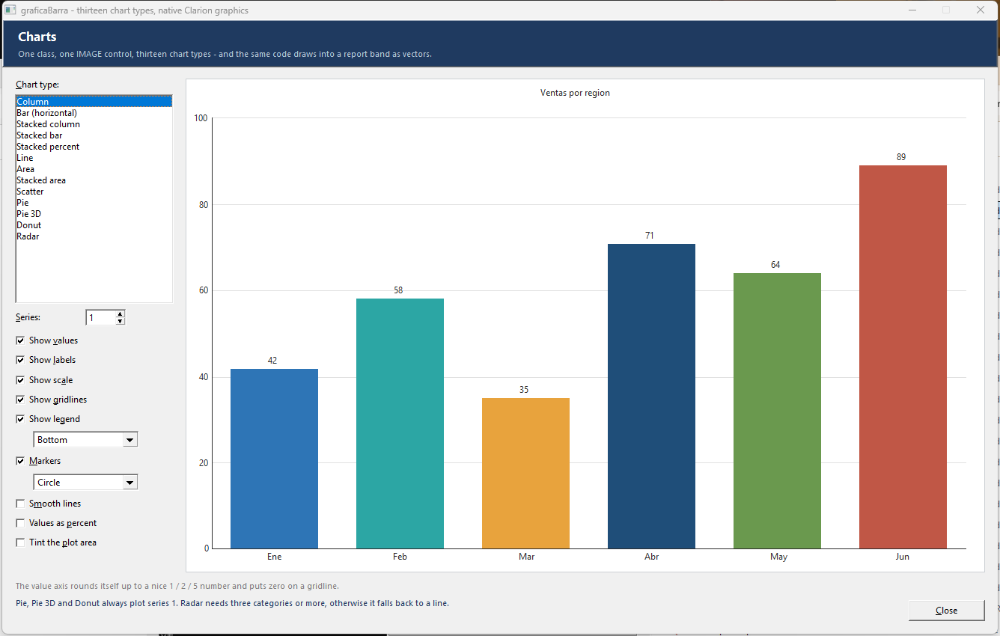

Highlights: automatic **"nice" scale** (max rounds up to 1/2/5×10ᵏ, and when the data crosses zero the axis
steps in nice units so **zero lands on a gridline**) or a fixed `SetRange`; **negative values** hang below
the baseline; **up to 4 series from the prompts** (8 from code) grouped, stacked or stacked-to-100; a
**legend** bottom/top/right that wraps; markers (circle/square/diamond); **smooth** Catmull-Rom lines;
values shown as numbers or **percentages**; category labels that thin themselves out rather than collide;
a 12-color professional palette or explicit colors; optional painted background, plot area and bar/slice
outlines. An empty data list draws **sample data suited to the chart type** — a built-in self-test.

The report path is still the point: **graficaBarraReport** draws **straight into the band as vector
primitives** under `SETTARGET(Report)` at `%BeforePrint` — never a bitmap — so a **PDF export stays as
small as possible**. Pie/3D pie/donut ride on Clarion's own `PIE` statement and areas and radar webs on
`POLYGON`, both of which are valid on a REPORT, so *every* type stays vector:

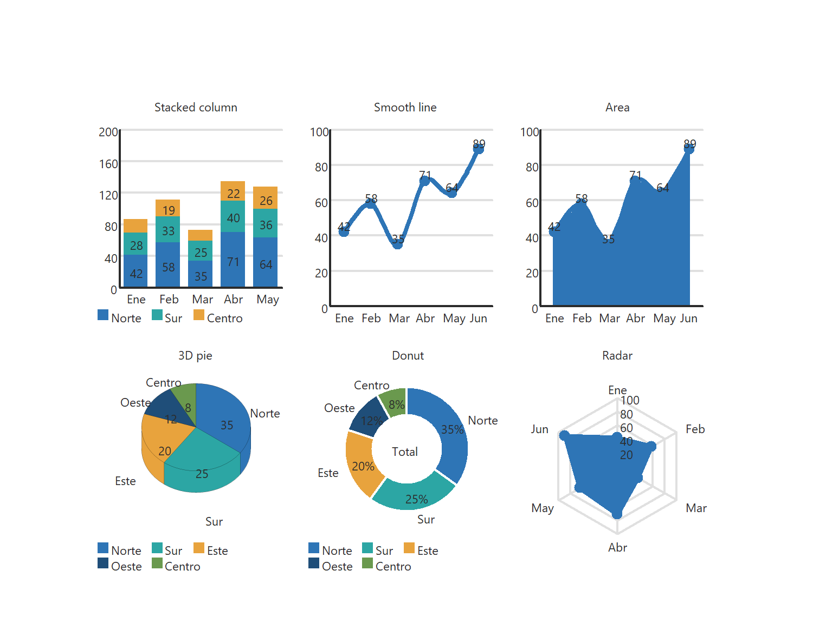

A control in the band (IMAGE/BOX/REGION) is used *only* as the position/size placeholder and is hidden at
print time. Each chart is aimed at **its own band** with `SETTARGET(report, band)` — the template works out
which band holds the placeholder from the report structure (indent level), so it handles a DETAIL, a group
HEADER/FOOTER or a FORM without being told. Both procedure extensions are **MULTI**, so you can put
**several charts on one report or one window** — each is its own local object, and on a report they follow
the band down the page as it repeats, each with its own data and its own auto-scale. On windows, **graficaBarra** draws into an `IMAGE` control
(redraw on open/resize, plus a generated `DO Refresh:<Object>` routine that re-reads variable/expression
values). Three registrations:
**graficaBarraGlobal** (include the class once), **graficaBarra** (window), **graficaBarraReport** (report).
Copy `GraficaBarraClass.inc` + `.clw` (ANSI) to the redirection path —
[`graficaBarra.zip`](templates/graficaBarra/graficaBarra.zip) bundles all three files for easy
distribution. `examples/graficaBarra/` has two runnable demos: **ChartDemo** (pick a type, watch it draw)
and **ChartShots** (six charts per page, `ChartShots 1|2|3`). Full docs — prompts, class API, run-time
control — in [`docs/graficaBarra-template.html`](docs/graficaBarra-template.html); a bilingual (English +
Spanish) developer's reference with worked example code is in
[`docs/graficaBarra-reference.html`](docs/graficaBarra-reference.html).

*Upgrading from v1?* Nothing to redo: `Chart:Column` is the default and the v1 API (`AddBar`, `ClearBars`,
`SetRange`, `Draw`, `Paint`) and prompts are unchanged, so existing charts generate and draw as before —
except that `TextColor` now actually works (`SHOW` takes its color from the target's *font*, not the pen,
so v1 silently drew all text in black; set `ColorText = 0` for the old behaviour).

### `templates/myGaugePlus/` — **antialiased** (GDI+) gauges/dials on windows
The pretty sibling of myGauge. Native Clarion `ARC`/`ELLIPSE`/`LINE` have **no antialiasing**, so round
gauges drawn with them look jagged — myGaugePlus draws every pixel with **GDI+** instead: smooth arcs with
rounded caps, a **glossy radial-gradient face**, an antialiased needle and crisp text, rendered to a PNG and
shown in an `IMAGE` control. It carries **no redistributable** — `gdiplus.dll` ships with Windows, and the
bridge to its flat C API is a tiny shim (`gpcanvas.c`) bound at runtime (`LoadLibrary`/`GetProcAddress`) and
compiled automatically by Clarion's own compiler (`PRAGMA('compile')` inside `AaCanvasClass.clw`) — so there
is **no manual project step**. Three layers ship together: **`gpcanvas.c`** (the GDI+ shim),
**`AaCanvasClass`** (a reusable antialiased 2D canvas — `Arc`/`Line`/`FillCircleGrad`/`Polygon`/`Text`/
`SavePng`, useful for any drawing), and **`GaugePlusClass`** (the gauge, with the *same* API shape as
`GaugeClass`: `SetRange`/`Preset`/`AddZone`/`SetValue`/`AnimateTo`/`Draw`). Same prompts and presets as
myGauge — arc styles, range, literal-or-variable value, ticks/labels, title/units, up to 16 colored zones,
and **eased needle animation** — plus a glossy **value/accent fill**, face-gloss and rim toggles, an
optional **face image** drawn as the dial's base layer (a photo/texture/logo dial, disc-clipped: set
`Gauge.FaceImage = 'path'`), and automatic **centring for every span** (90/45/180/custom sit centred in the
control, not just the full 270/360 dials). Three
registrations: the **myGaugePlusControl** control template (drag-on, self-contained) and the
**myGaugePlusGlobal** + **myGaugePlus** (window) extensions. The transparent PNG composites cleanly onto any
window; it is **window-only** (use myGauge for report-band gauges). Copy the five files
(`GaugePlusClass.inc/.clw`, `AaCanvasClass.inc/.clw`, `gpcanvas.c`, all ANSI) to the redirection path. Full
docs — how it works, prompts, the `GaugePlusClass` + `AaCanvasClass` API, and gotchas — are in
[`docs/myGaugePlus-template.html`](docs/myGaugePlus-template.html). A hand-coded, ready-to-compile
**live property playground** — [`examples/myGaugePlus/GaugePlusPlayground.clw`](examples/myGaugePlus/GaugePlusPlayground.clw)
(build `GaugePlusPlayground.cwproj`) — drives *every* property in real time from a tabbed panel of sliders,
radios, check boxes and colour pickers beside a big live gauge, so you can see exactly what each option does
before wiring the template.

### `templates/myCompress/` — pure-Clarion compression (memory + files)
A self-contained **compression library** written entirely in **pure Clarion** — no DLL, no external
library. One self-contained ANSI class, **`CompressClass`**, implements **DEFLATE (RFC 1951)** with the
**zlib (RFC 1950)** and **gzip (RFC 1952)** wrappers, so a `.gz` it writes opens in gzip / 7-Zip /
browsers / .NET `GZipStream`, and it reads any DEFLATE-family stream those tools produce. Decompression
(INFLATE) is complete — stored + fixed + dynamic Huffman; compression is **LZ77** (a hash-chain match
finder) + fixed Huffman, with Level 0 emitting stored blocks. Add **one global extension** —
**myCompress - Global Compressor** — and reach the shared object from any embed; there is **no per-window
or per-report wiring** (compression is all code-driven). It works on **memory buffers** (length-explicit
`Compress`/`Decompress(*STRING,LONG,*STRING)`) **and files** (`CompressFile`/`DecompressFile`), carries
**CRC32** (gzip) and **Adler32** (zlib) checksums, and ships a `SelfTest()` smoke test. Pick the format
(`Cmp:Raw`/`Cmp:Zlib`/`Cmp:Gzip`) and level (0–9) at run time; decompression **auto-detects** the
container. The codec is validated by a .NET golden-vector oracle, [`designer/CompressCore/`](designer/CompressCore/),
that round-trips a corpus both ways (Clarion ↔ `GZipStream`/`ZLibStream`/`DeflateStream`). Copy
`CompressClass.inc` + `CompressClass.clw` (**ANSI, CRLF**) to the redirection path.

**Optional C fast-path (~4× faster).** For big files or high throughput, pick the **C engine** in the
extension's *Compression engine* prompt. It's `CompressClassC` — a thin subclass that overrides the virtual
`Wrap`/`Unwrap` to call **`mc.c`**, our own clean-room DEFLATE port (not miniz/zlib/StringTheory) compiled by
**Clarion's own C compiler** via `PRAGMA('compile(mc.c)')`. Compression of a 4 MB buffer drops from ~844 ms
to ~200 ms (and a slightly better ratio, since C has no 64 KB-array limit so it uses the full 32 KB window).
It's the same algorithm, so the two engines produce byte-compatible output and interoperate freely. The
switch is the **template prompt** (it declares the global object as `CompressClass` or `CompressClassC`), so
a pure-Clarion app needs **no `mc.c` and no subclass** — copy the C files only when you choose that engine.

Full programmer's documentation — the API, formats, run-time control, the C fast-path, error codes, and
troubleshooting — is in [`docs/myCompress-template.html`](docs/myCompress-template.html).

### `templates/myPdfSign/` — read a signed PDF and see who signed it
A self-contained **signed-PDF identity reader** written entirely in **pure Clarion** — no DLL, no external
library, no network. One ANSI class, **`PdfSignClass`**, opens a digitally-signed PDF and surfaces the
**authoritative signer identity** that lives in the embedded **PKCS#7 / CMS** signature: the signer
certificate's **Subject** (`SubjectCN` / `SubjectO` / `SubjectOU` / `SubjectEmail`), the issuing CA
(`IssuerCN`), the **signing time** (`SignTime`, ISO-8601 UTC, read from the signed attributes — not the
spoofable `/M`), plus the signature dictionary's own `/Name` (`SignerName`), `/Reason`, `/Location`,
`/SubFilter`, and a `SigCount`. It also reports **`CoversWholeFile`** — 1 when `/ByteRange` spans the whole
file, 0 when bytes were appended after signing (a tamper / incremental-update hint). It works on **files**
(`ReadFile`) or a **memory buffer** (`Read(*STRING,LONG)`), exposes a `Report()` block and a `SelfTest()`.
Internally it finds the `/ByteRange` + `/Contents <hex>` signature dictionary, hex-decodes the DER blob, and
a tiny **ASN.1 tag/length reader** walks `ContentInfo → SignedData → certificates[0] → tbsCertificate` to
read the Subject/Issuer RDNs by OID and the `signingTime` attribute. **Scope (be honest):** it extracts the
*named* signer + an integrity hint — it does **not** cryptographically verify the RSA/ECDSA signature or
validate the certificate trust chain. Add **one global extension** — **myPdfSign - Global signed-PDF reader**
— and reach the shared object (default `PdfSig`) from any embed; there is **no per-window or per-report
wiring**. Validated end-to-end against the real Clarion compiler and a .NET golden-fixture oracle
([`designer/PdfSignCore/`](designer/PdfSignCore/)) that **manufactures real signed PDFs** (CA-signed leaf
certs, detached PKCS#7 over a proper `/ByteRange`, `signingTime` in the signed attributes) and publishes the
ground-truth identity each one must yield — the Clarion `Report()` output matches **byte-for-byte across all
three fixtures**, including a deliberately tampered case that correctly reports `CoversWholeFile=0`. Copy
`PdfSignClass.inc` + `PdfSignClass.clw` (**ANSI, CRLF**) to the redirection path. Full programmer's
documentation is in [`docs/myPdfSign-template.html`](docs/myPdfSign-template.html).

Simplest possible use — declare the object, read a PDF, show the result (the `myPdfSign` global extension
declares `PdfSig` for you; in a hand-coded program just `INCLUDE('PdfSignClass.INC'),ONCE` and declare it):

```clarion
PdfSig  PdfSignClass                    ! one object is all you declare

  CODE
  IF PdfSig.ReadFile('contract.pdf')    ! open + parse the PDF
    IF PdfSig.Signed                    ! did it carry a signature?
      MESSAGE('Signed by : ' & CLIP(PdfSig.SubjectCN)    & |
              '|e-mail    : ' & CLIP(PdfSig.SubjectEmail) & |
              '|Issued by : ' & CLIP(PdfSig.IssuerCN)     & |
              '|Signed at : ' & CLIP(PdfSig.SignTime)     & |
              '|Intact?   : ' & CHOOSE(PdfSig.CoversWholeFile=1,'YES','NO — bytes added after signing'),|
              'Signature')
    ELSE
      MESSAGE('That PDF is not digitally signed.','Signature')
    END
  ELSE
    MESSAGE('Could not read the file: ' & CLIP(PdfSig.ErrText),'Error')
  END
```

In an AppGen app, add the **myPdfSign - Global signed-PDF reader** extension once, then drop the
`IF PdfSig.ReadFile(...) ... END` body into any embed (e.g. a button's **Accepted** embed). Parsing a PDF
already in memory? Use `PdfSig.Read(buffer, length)` instead of `ReadFile`.

### `templates/my3D/` — real WebGL2 3D scenes driven from Clarion
A **3D scene manager** that lets a Clarion app build and display **hardware-accelerated WebGL2** scenes with
**no JavaScript**. One ANSI class, **`WebGL2Class`**, exposes a rich object-oriented 3D API — **camera**
(`SetCamera`/`LookAt`/`SetFOV`/`OrbitCamera`), **lighting** (ambient, a directional key light, and up to 8
coloured **point lights**), **materials** (colour, metalness, roughness, opacity, emissive glow, wireframe),
**20+ mesh primitives** (`AddCube`, `AddSphere`, `AddCylinder`, `AddCone`, `AddPlane`, `AddTorus`,
`AddTorusKnot`, and the five Platonic solids `AddTetra`/`AddOcta`/`AddIcosa`/`AddDodeca`), **per-mesh
transforms** (`SetPos`/`SetRot`/`SetScale`/`SpinMesh`), plus **fog**, a ground **grid** and **axes**. It also
ships genuine **3D maths that run in Clarion** — a `Vec3` set (`Vec3Length`/`Distance`/`Dot`/`Cross`/
`Normalize`/`Lerp`) and a `Mat4` set (`Mat4Identity`/`Translate`/`Scale`/`RotateX/Y/Z`/`Perspective`/
`Multiply`) — so positions can be computed Clarion-side. `Show()` writes a **single self-contained `.html`**
(the scene data **plus** the verified `my3D.engine.js` renderer, inlined) and opens it in the default
browser; **drag to orbit, wheel to zoom, R to reset**. It can also render **inside a Clarion window** —
`ShowEmbedded()` positions a borderless Edge window (real WebGL2, its own process so it can't destabilise
Clarion) as an **owned overlay** over your window or a control in it; being a top-level window keeps it fully
interactive (drag/wheel/keys). The control template's **Show in** dropdown picks External browser or
Embedded. Pure Clarion: no DLL, no COM, no package — file IO via the ASCII driver, launch via
`rundll32 …FileProtocolHandler`.

Add the control template **my3D - 3D Scene Viewer button** to any window and configure the whole scene from
the AppGen prompts (canvas, camera, background, grid/axes/fog, lights, and a **MULTI** list of meshes), or
drive the class directly:

```clarion
Scene  WebGL2Class                              ! one object = one 3D scene

  CODE
  Scene.SetCamera(7, 6, 11);  Scene.LookAt(0, 0.5, 0)
  Scene.SetDirLight(-1,-2,-1.3, 1,0.97,0.9, 1.1)
  Scene.AddPointLight(4,3,4, 1,0.4,0.2, 1.2, 18) ! a warm point light
  Scene.SetColor(0.20,0.55,0.95);  Scene.SetSpin(0,0.6,0)
  Scene.AddCube(1.4)                             ! a spinning blue cube
  Scene.SetColor(0.2,0.85,0.85);  Scene.SetMaterial(0.7,0.2)
  Scene.SetPos(Scene.AddTorusKnot(0.7,0.2,2,3), 3, 0.9, 0)
  Scene.Show()                                   ! writes .html and launches the browser
```

Two example programs live in [`examples/my3D/`](examples/my3D/): **`My3DModels`** — a gallery of **10
real-world objects modelled from primitives** (a car, an airplane, a rocket, a wind turbine, a robot, a
table &amp; chairs, a house, a building foundation, a skyscraper and a park of trees) — and **`My3DDemo`**, a
**proof-of-concept app with 20 fixture scenes** (spinning primitives, a 7×7 sphere grid, the Platonic
solids, a 120-cube random field, a material matrix, point-light and fog demos, a solar system whose planet
orbits are placed with the class's own `Vec3` maths, a Fibonacci sphere, a "mega" scene, and a
**Vec3/Mat4 self-test**). Both build with their shipped `.cwproj`. Copy `WebGL2Class.inc` + `WebGL2Class.clw` (**ANSI, CRLF**) to the redirection path, and
ship **`my3D.engine.js`** beside the compiled `.exe` (it is read at run time and inlined into each page).
Full programmer's documentation — a guided tour in [`docs/my3D-template.html`](docs/my3D-template.html), and
the **exhaustive per‑method/per‑property API reference with example code for each** in
[`docs/my3D-reference.html`](docs/my3D-reference.html).

### `templates/myYuru/` — yuruyurau animated flow-field art on a window
Live **generative "flow-field" animation** — the pure-trigonometry particle sketches of the artist
[@yuruyurau](https://twitter.com/yuruyurau) — playing on a Clarion **`IMAGE` control**, offline and with **no
dependencies**. Clarion has no per-pixel canvas, so one self-contained ANSI class, **`YuruClass`**, plots
~10,000 particles (30,000 for *Lattice*) **additively** into an in-memory **24-bit BMP** each frame — so
overlapping points glow the way the semi-transparent p5.js originals do — writes it to a temp file and
reloads the control (two temp files are alternated per object so the control never locks the frame being
written). A window **`TIMER`** drives the loop. Six presets ship: **Ribbon, Seashell, Nebula, Lattice,
Reeds** and **Plume**, each with its own natural time step; pick any **ink color** (a 10-swatch professional
palette, no purple), the background grey, the per-point **glow**, and a **speed** multiplier. Each animation
on a window is its **own local object**, so several can run at once.

**Optional GPU backend (`Flow.Backend = Yuru:Direct2D`).** The BMP-file round-trip was never the real
cost — computing 10–30k particles and plotting them additively through Clarion string indexing is. So the
Direct2D backend does two things: it builds the **whole frame in native C** (`yuru_native_frame`, the six
sketches ported 1:1, skipping the Clarion loop) and blits it **straight to a GPU-composited child window**
over the IMAGE control — no temp file, no reload. On the heaviest preset (Lattice, 30k particles) that's
**~7 → ~59 fps (8.5×)**; the lighter presets faster again. The C shim **`yurucanvas.c`** binds `d2d1.dll`
through hand-declared COM vtables and implements `sin/cos/sqrt/atan2` in pure C, so there is still **no
redistributable** (Direct2D ships with Windows 7+); it's compiled in automatically by a `PRAGMA` in the
class. If the target can't be created it silently falls back to the BMP path, so the default (`Yuru:BmpFile`)
stays pure Clarion. `SetBackend()` switches at runtime. The GPU host **follows the IMAGE control** — when the
window (and an anchored control) is resized, each frame re-reads the control's pixel rect and moves/resizes the
child host **and** its render target to match, so the art fills the grown control instead of staying boxed in
its original size.

**Easiest path: a control template** — drag **myYuru - Yuruyurau animation** onto a window and it drops the
IMAGE *and* wires the animation in one go, fully self-contained (it `INCLUDE`s the class itself, so no global
extension is needed). Three registrations: the **myYuruControl** control template (drag-on, self-contained)
plus the **myYuruGlobal** (include the class once) and **myYuru** (window) extensions, which wire the object
at `EVENT:OpenWindow`, repaint on a private per-instance `Redraw` event, step on `EVENT:Timer`, and generate
`Start:`/`Stop:`/`Restart:` routines you can `DO` from any embed — and both templates expose a
**Rendering → Backend** choice (BMP file or Direct2D GPU). Copy `YuruClass.inc`, `YuruClass.clw` and
`yurucanvas.c` (**ANSI, CRLF**) to the redirection path; the app needs the **DOS file driver**. A hand-coded,
ready-to-compile demo — [`examples/myYuru/YuruDemo.clw`](examples/myYuru/YuruDemo.clw) (build
`YuruDemo.cwproj`) — mirrors the web app at `c:\ai\yuruyurau\index.html`: a live canvas with preset / ink /
speed pickers, a **GPU (Direct2D)** toggle, and Start / Stop / Reset / Save buttons. The six presets, rendered
by the class itself:

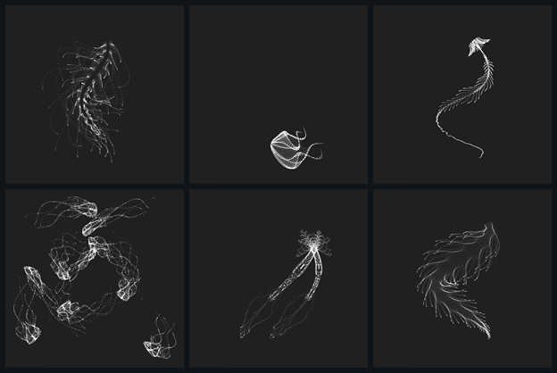

### `templates/myCalc/` — a pop-up calculator beside any numeric field
Drag **myCalc - Calculator button** next to a numeric entry and point it at that entry. A small calculator
icon appears; pressing it opens a modal calculator already holding whatever the field contains, and **Accept
puts the answer back into the field**.

**Four calculators in one window**, chosen from a drop list: **Standard** (four functions, memory, percent),
**Scientific** (trig, logs, powers, roots, factorial, parentheses, DEG/RAD), **Programmer** (HEX / DEC / OCT /
BIN with the out-of-range digits greyed out, AND OR XOR NOT, Lsh/Rsh, MOD, 8/16/32-bit word size) and
**Accountant** — a real adding-machine tape where `+` and `-` post the entry to the roll and SUBT / TOTAL / GT
print the running figures, with TAX+ / TAX- keys at a configurable rate. A **paper roll** runs down the side:
the tape in accountant mode, the history of finished calculations in the others, copyable to the clipboard.

**It remembers where you left it.** Which calculator you were last on comes back the next time the *program*
runs, along with DEG/RAD, the number base, the word size, the decimals and the tax rate — each profile saved
under its own INI section. **And it speaks Spanish**: the **language setting on the global extension** is what every
calculator in the application follows — mode names, window labels and the word keys (Borr, SUBT, TG,
IVA+/IVA-, Aceptar, Cancelar) — with an optional per-button override. The language is deliberately *not*
remembered between runs: there is no language picker in the calculator, so it is the template's call, and
saving it would let an old value shadow whatever you set today. Digits, operators and the maths names read the same
either way.

The keypad is a 7×7 grid re-labelled per mode, driven through a single `Press(action, text)` entry point — so
the whole calculator can be exercised from code or from a test without opening a window, which is exactly how
its 24-case arithmetic suite runs. Three registrations: **myCalcButton** (the drag-on control template, MULTI),
**myCalcHere** (a code template for an existing button, menu item or hot key) and **myCalcGlobal** (the class
plus the application language). Copy `CalcClass.inc`, `CalcClass.clw` (**ANSI, CRLF**) and `calc16.ico` to the
redirection path — the icon is compiled into the exe's resources, so there is nothing extra to deploy. A
runnable demo is [`examples/myCalc/CalcDemo.clw`](examples/myCalc/CalcDemo.clw), and the full
programmer's documentation — **bilingual English/Spanish** — is
[`docs/myCalc-template.html`](docs/myCalc-template.html).

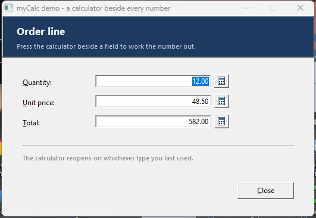

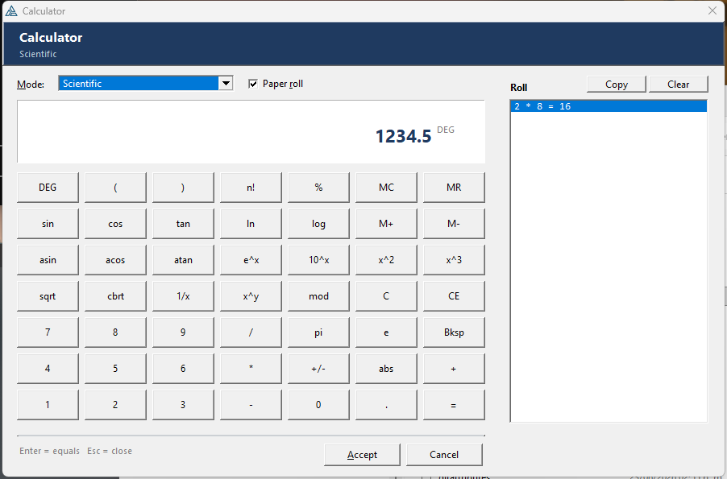

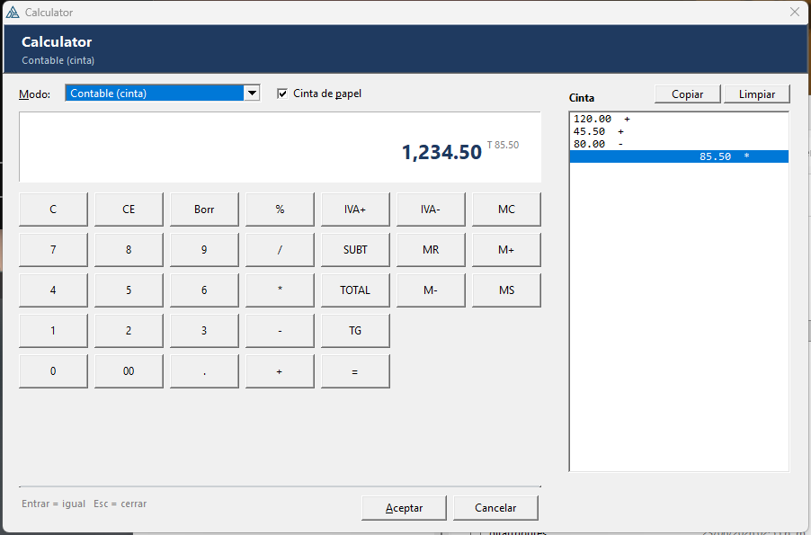

### `templates/myCalendar/` — a pop-up date picker beside any date field
Drag **myCalendar - Calendar button** next to a date entry and point it at that entry. A small calendar icon
appears; pressing it opens a modal calendar already sitting on whatever the field holds, and **Accept puts the
date back into the field**.

**One button can fill in two fields.** Set *Pick* to *a from-and-to range* and the user **drags across the
days** — over as many months as are on screen — to sweep out a period; the first day goes into the FROM field
and the last into the TO field, sorted whichever way they dragged. The selection follows the mouse live, and
**every press starts a fresh range** — putting the mouse down on a day clears whatever was marked before and
anchors there, so you never have to untangle a new sweep from the last one.

**How much is on screen is up to you and the user**: one month, two, three, six, or a **full year** — and two
and three can be stacked **across** (side by side) or **down** (one under the other), with six going 3×2 or
2×3 and a year 4×3 or 3×4. Both the view and the stacking are drop lists in the window itself, and **the
window is only ever as wide as the calendar** — when the months are narrower than the navigation strip needs
on one row, the strip wraps onto two rows rather than dragging the window out with it, so one month opens at
345 px instead of 811 and three months stacked down is a genuinely narrow column. **Both choices come back
the next time the program runs** (per profile, in the
app's own INI) along with the first day of the week, the week-number gutter and the today ring. Navigation is
`<<` year, `<` month, a month drop and a year spin, `>` month, `>>` year, plus **Today**. Options cover
**ISO-8601 week numbers**, Sunday or Monday first, today ringed in amber, **weekends blocked**, and earliest /
latest date allowed — blocked days are simply deaf to the mouse, so there is no error box to dismiss.

**And it speaks Spanish**: the **language setting on the global extension** is what every calendar in the
application follows — month names, day headings, the view and stacking lists, Today / Clear / Accept / Cancel
and the footer that counts the days — with an optional per-button override. Like myCalc, the language is
deliberately *not* remembered between runs, so changing the setting takes effect immediately.

The months are painted with native `BOX` / `LINE` / `SHOW` into an IMAGE (the two-argument
`SETTARGET(window, ?image)`, so 0,0 is the image's own top-left) with a transparent `REGION` + `IMM` over the
top to collect the mouse — which is what makes a whole year cheap enough to draw, and makes the hit test plain
arithmetic. `Layout()`, `Draw()` and `DateAt()` are public, so the same class will paint an always-visible
calendar into an IMAGE on a window of your own; the date maths (`AddMonths` with the short-month clamp,
`DaysInMonth`, ISO `WeekNumber`, `DayOfWeek`) stands alone as well. A 62-assertion headless suite covers all of
it. Three registrations: **myCalendarButton** (the drag-on control template, MULTI, single-date or from/to),
**myCalendarHere** (a code template for an existing button, menu item or hot key) and **myCalendarGlobal**
(the class plus the application-wide language, first day, view and stacking). Copy `MyCalendarClass.inc`,
`MyCalendarClass.clw` (**ANSI, CRLF**) and `cal16.ico` to the redirection path — the icon is compiled into the
exe's resources, so there is nothing extra to deploy. **The class is `MyCalendarClass`, not `CalendarClass`** —
ABC already ships a `CalendarClass` in `ABUTIL`, and the two link into the same program as
`Duplicate symbol: TYPE$CALENDARCLASS`. A runnable demo is
[`examples/myCalendar/CalendarDemo.clw`](examples/myCalendar/CalendarDemo.clw), and the full programmer's
documentation — **bilingual English/Spanish** — is
[`docs/myCalendar-template.html`](docs/myCalendar-template.html).

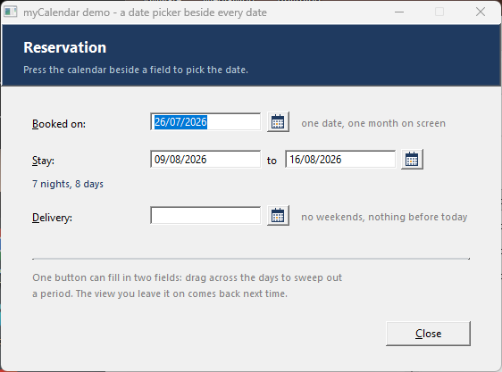

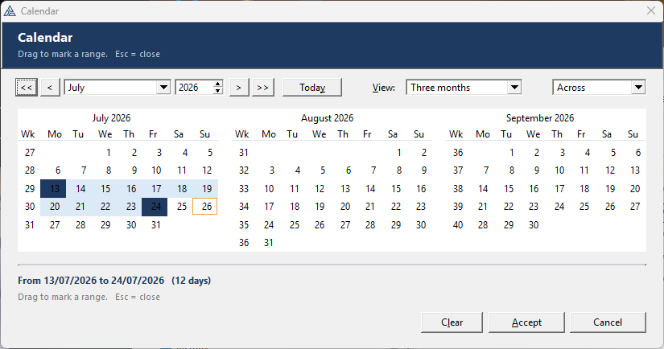

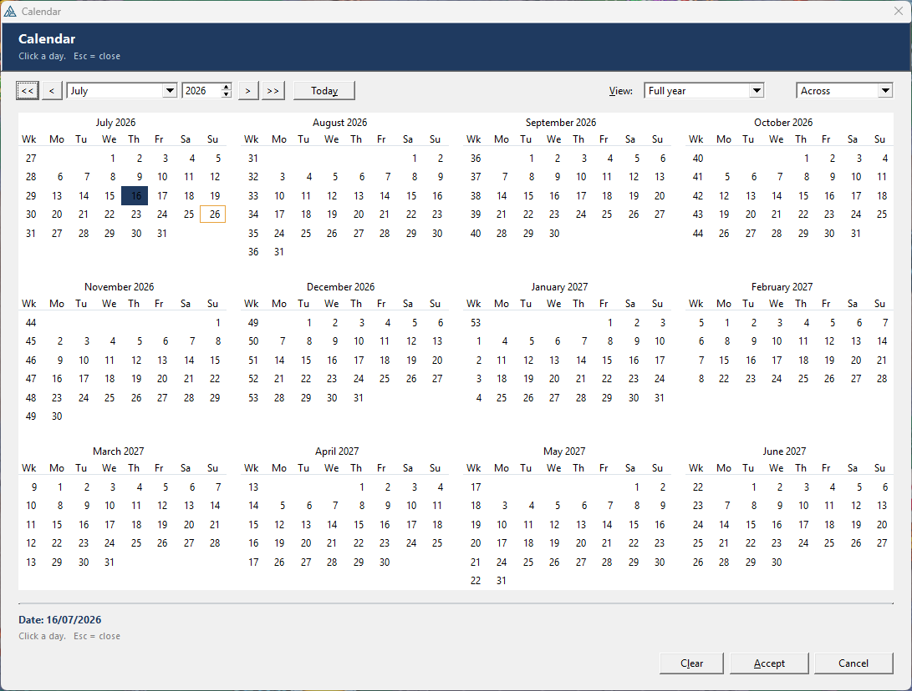

### `templates/myFilter/` — build filters for any browse
Drop **myFilter - Filters button** on a browse window and name the browse object. Pressing the button opens a
window listing **the browse's own fields**: pick one, say how to test it, press Add, repeat. **Apply** hands
the browse a real filter.

The field list is not typed by hand — the template walks the browse's queue back to the dictionary fields at
generate time, the same way the shipped QBE does (`#FOR(%QueueField)` → strip any `[subscript]` →
`#FIX(%Field,…)`), then the joined files, with a fall-back to every field if the view is entirely PROJECTED.
Each field's type comes from its picture first and its storage second, so a date held in a LONG is still
offered date tests.

**23 tests, offered by type.** Text: equals, not equals, begins with, ends with, contains, doesn't contain, is
empty, is not empty, matches a `*`/`?` pattern. Numbers: the six comparisons, between, not between. Dates: all
of those plus **is today, was yesterday, in the last N days, in the next N days, in month, in year**. Flags:
is yes / is no. Conditions join with **AND or OR**, the built expression is on screen as you go, and filters
can be **saved by name** and picked again later.

**The filter is ANDed, not substituted.** It goes in through `BRW1.SetFilter(expr,'7 myFilter')` — ABC keeps
filters in a named, conjunctive list, so a range limit, a locator or a QBE still apply alongside it, and
applying an empty filter deletes the slot rather than leaving a stale one behind.

**One prerequisite: tick Bindable on the file in the dictionary.** A filter is evaluated by field name at run
time and the runtime refuses a field it was never told about — `BIND has not been called for CUS:Name`. ABC
calls `BIND` on every file open, but only for a file carrying `BINDABLE`.

Every operator was **measured, not assumed**: a probe builds a real TPS file and runs each candidate
expression against a VIEW. That caught two things that would otherwise have shipped broken — slicing a field
inside a filter (`UPPER(f)[1 : 5] = 'SMITH'`) **silently matches every record**, so "begins with" uses `SUB()`;
and the BIND requirement above. A 102-assertion suite applies every generated expression to a real file and
counts the surviving rows, apostrophes in values and decimal points included. Saved filters reload by **field
name, not position**, so adding a column to the browse cannot silently repoint an old filter at another field.

Saved filters live in the application's own INI by default — no setup, per user. For filters shared between
users, [`templates/myFilter/FilterTables.txt`](templates/myFilter/FilterTables.txt) has the `FilterHdr` /
`FilterLine` structures and the operator numbers; derive the class and fill in the four table hooks. Three
registrations: **myFilterButton** (the drag-on control template, MULTI), **myFilterHere** (a code template for
a button or menu you already have) and **myFilterGlobal** (the class, the language and the storage choice).
Copy `MyFilterClass.inc` and `MyFilterClass.clw` (**ANSI, CRLF** — they are pure ASCII) to the redirection path.

### `templates/myExport/` — export any browse or list to seven file formats
Drag **myExport - Export button** onto a browse window and you get a wired-up **Export…** button. Pressing it
opens a modal dialog that asks for the **format**, the **folder and file name** (through the standard Windows
Save-As browser) and **which columns to send** — then writes **CSV**, **CSV UTF-8** (with the BOM Excel needs
before it trusts accents), **TSV**, **XML**, **JSON**, **HTML** or a real **Excel `.xlsx`** workbook.

**The column picker.** Every data column is listed with a tick box, so the user can leave columns out,
**rename** one for the file, or give it a **different picture** — with the list's own heading shown alongside
so nothing gets lost. A blank picture writes the **raw** value (handy for JSON and Excel, where an
unformatted number beats a formatted string), and renaming also renames the XML element and the JSON key.
**All / None / Defaults** act on the lot. The choices **survive between exports**: the generated code
re-`Init`s before each one, so the scan fingerprints the list's layout (column count, field numbers, widths)
and only rebuilds when that actually changes. One prompt (`AllowColumns`) hides the whole picker and shrinks
the dialog back to format + file name if you'd rather lock it down, and every button it offers is also a
public method — `ColumnUse`, `ColumnRename`, `ColumnPicture`, `SelectAll`, `ResetColumns` — so you can preset
the columns from code.

**It remembers how you left it.** With `Persist` on (the default), a successful export writes the format,
the folder, the three tick boxes and the entire column list — which are on, every rename, every picture
override — into an INI section, and the dialog restores them the next time the *program* runs, not just
the next time the window opens. The section is named from a **profile** (the procedure name by default),
so two browses never overwrite each other, and a short fingerprint of the list's layout guards the column
half: add or resize a column and the stale column settings are discarded rather than landing on the wrong
column, while the format and folder still come back. `LoadSettings` / `SaveSettings` / `ForgetSettings`
are public, so an unattended nightly export can restore a saved profile and run with no dialog at all.

**No external program is needed for the Excel format.** An `.xlsx` is a ZIP of XML parts, and `ExportClass`
writes both — the six OOXML parts *and* the ZIP container (local headers, CRC-32, central directory, EOCD) —
so there is no helper `.exe`, no Python, no COM automation, no Excel installation and nothing to redistribute.
The workbook is not a renamed CSV: **numeric columns become real numeric cells** (`<v>1234.56</v>`, so SUM,
sorting, filtering and charts work), with a **bold heading row**, a **frozen pane**, an **auto-filter** and the
**column widths carried over from the screen**. Validated end-to-end against `openpyxl`.

**You never describe your columns to it.** At click time it reads the LIST control's own `FORMAT` —
`PROPLIST:Exists` / `FieldNo` / `Header` / `Picture` — and pulls values with `WHAT(Queue,FieldNo)`, the same
recipe the shipped `brwext.clw` uses. So the file matches the screen exactly, including columns the *user*
re-ordered, resized or hid after the window opened. The **queue is discovered at generate time** from the
LIST's own `FROM()` attribute (`EXTRACT(%ControlStatement,'FROM',1)` — what the shipped BrowseBox does), so
there is nothing to type. By default it walks the **whole browse view** (`BRW1.Reset()` → `Next()` →
`SetQueueRecord()`), honouring the current sort order, range limits and filters — not just the page of rows
the ABC queue happens to hold; a queue-only mode is one prompt away for hand-coded lists.

Three registrations: **myExportButton** (the drag-on control template, `MULTI`, self-contained),
**myExportHere** (a code template for an existing button, menu item or toolbar entry) and **myExportGlobal**
(optional — only if you want the class in procedures with no button). Copy `ExportClass.inc` and
`ExportClass.clw` (**ANSI, CRLF**) to the redirection path. `.xlsx` parts are **stored** by default so the
class has zero dependencies; if you also have **myCompress**, setting `_ExportDeflate_` to 1 in
`ExportClass.inc` switches them to real DEFLATE and shrinks a big workbook by roughly 10×. A runnable demo —
[`examples/myExport/ExportDemo.clw`](examples/myExport/ExportDemo.clw) — is a plain list with one Export
button plus a "write all seven" self-test. Full programmer's documentation:
[`docs/myExport-template.html`](docs/myExport-template.html).

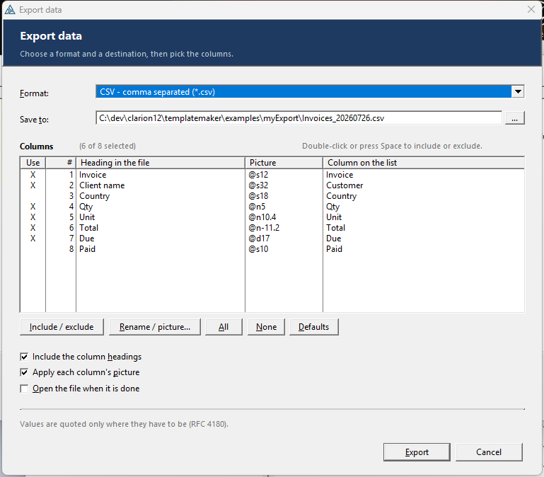

### `templates/myHook/` — intercept MESSAGE, STOP, HALT and run-time errors
Add **myHook - Global message/stop/halt interceptor** once to the application and the Clarion run-time
library's own dialogs stop being the run-time library's business. `MESSAGE`, `STOP`, `HALT`, a failed
`ASSERT`, a run-time error and a GPF each get a default action — **show it as usual**, **ignore it**,
**answer it for the user**, **show it as a plain message**, **hand it to a procedure of yours**, or
**write it to the log and swallow it**.

This is built on the run-time library's own extension points — `SYSTEM{PROP:MessageHook}`,
`{PROP:StopHook}`, `{PROP:HaltHook}`, `{PROP:AssertHook}` / `{PROP:AssertHook2}`, `{PROP:FatalErrorHook}`
and `{PROP:LastChanceHook}`. The exact hook prototypes are taken from the shipped WebBuilder layer,
`\clarion12\libsrc\win\WBHOOK.CLW`, which uses the same seven to move a desktop `MESSAGE` onto a web page.

**The rules tab** is where it earns its keep. Test the message text — *contains* / *starts with* /
*is exactly* / *matches a `*` `?` pattern* — against the text, the caption or either, and give the ones
that match their own treatment. Rules are checked in order, the first match wins, and anything matching
nothing falls back to the default for its kind of event. So a stray *"Record Not Found"* can be answered
`Ok` and logged while every other message still reaches the user untouched.

**The log** is a plain text file, CSV (with a heading row) or tab separated. It is opened for append and
closed again on every line, so threads can share it, two copies of the program can share it, and a line
written immediately before a `HALT` is still on disk afterwards. Each line carries the date and time, the
kind of event, the thread, the window that was on screen, the caption, the text flattened to one line,
what was done about it, and for an `ASSERT` the source file and line. Give it a size limit and it rolls
over to a `.bak` on its own.

**One honest limitation, established by test, not assumption: a `HALT` cannot be called off.** The
run-time library ends the program as soon as the halt hook returns, whichever action you pick — so for a
`HALT` the choices change what is *said* on the way out and what lands in the log, not whether it happens.
A `STOP`, by contrast, really can be ignored: the line after it runs. The prompts and the class header say
so plainly, and `HALT` defaults to *write it to the log, then halt*.

Three registrations: **myHookGlobal** (`APPLICATION` — the whole thing, added once), **myHookPause**
(a procedure extension that lets one procedure's messages through untouched, on that thread only) and
**myHookHere** (a code template to install, remove, suspend, resume, or write your own line to the log from
any embed). Copy `MsgHookClass.inc` and `MsgHookClass.clw` (**ANSI, CRLF** — they are pure ASCII) to the
redirection path.

Verified by building a standalone program against the class and running it: a message with no matching rule
answered with the configured button, a `*wildcard*` rule answering `Retry`, a rule handing off to derived
code that answered `Cancel`, a `STOP` ignored with execution continuing past it, the counters, the CSV
quote-doubling, and the roll-over to `.bak`.

Full programmer's documentation, English and Spanish in one page with a language toggle:
[`docs/myHook-template.html`](docs/myHook-template.html).

## Install

Copy the two folders into your Claude Code config (`~/.claude` on macOS/Linux,
`C:\Users\<you>\.claude` on Windows):

```sh
cp -r skills/clarion-template ~/.claude/skills/
cp agents/clarion-template-pro.md ~/.claude/agents/
```

Restart Claude Code (or start a new session) so the skill and agent are picked up.

## Visual designer & installer

`designer/ClarionTplDesigner/` is a **.NET 9 / WPF** visual designer for a template's *prompt UI*:
open a `.tpl`, see each `#TAB`'s controls at their real `AT()` positions (icons render as the actual
PNGs), then **drag, resize, snap to a grid/guides, re-order, add, delete, and group** controls — and save,
rewriting only the `AT()` values (plus dropping deleted lines and relocating reparented ones). An *Add:*
command bar inserts new Label/String/Number/Spin/Check/Image/Group controls — and a whole new `#TAB`;
in the flow preview you can **drag a tab's header onto another to reorder the tabs** (a caret shows where it
will land), and the whole `#TAB`…`#ENDTAB` block moves with it;
dropping a control into a group box makes it a child (and moving the box carries its contents); guides pull from the rulers and are
removed by dragging them back onto a ruler; deleting a control whose `%symbol` is still referenced
elsewhere pops a warning so you don't break code generation. Selecting a control surfaces its **`%symbol`**
in the Properties pad with a navigable **Uses** list (every place across all files the symbol appears — click
to jump to that line) and a **Rename** button that renames it *everywhere at once* (prompt **+** every
reference) so the field stays joined; newly added controls can be named the same way. Select several
controls and **align / distribute / size them together** (Arrange menu or right-click), or **group them
into a box** (`Ctrl+G`) / **ungroup** (`Ctrl+Shift+G`). Dragging shows **smart alignment guides** that snap
to other controls' edges with a live spacing readout. An **Outline** panel shows the whole
`#SHEET`/`#TAB`/`#BOXED`/control tree with a find box; a **Symbols** panel lists every `%symbol` with its
use count and click-to-jump; a tab's **`WHERE(...)` visibility condition** is editable from its right-click
menu; a **Problems** panel flags
unbalanced blocks, duplicate/unused symbols, off-canvas or overlapping controls and risky auto-built
prompts (click to jump). Added `#PROMPT` controls get a friendly **type / REQ / DEFAULT** editor, and tabs
can be **renamed or deleted** (right-click a tab header). Controls can be **copied/cut/pasted/duplicated**
(`Ctrl+C/X/V/D`, with fresh `%symbols`), **snippets** drop in ready-made groups (Insert ▸ Snippets), and
**File ▸ Preview changes** shows a colour-coded per-file diff of exactly what a save will write. The source
panel has **find/replace** (`Ctrl+F`) and **`%symbol` / `#directive` autocomplete**. A fixed **icon command
bar** (Open, Recent, Save, Preview changes, Undo, Copy/Paste, Check problems, Find, Preview) sits under the
menu, and **recent templates** are remembered (toolbar dropdown and File ▸ Open Recent). The **Help** menu opens a built-in **User Manual**
(press `F1`) and **Programmer's Reference** — beautifully formatted HTML guides bundled into the app
(sources in `docs/`). See `designer/ClarionTplDesigner/README.md`.

**Clarion-accurate prompt fidelity (v2.8).** The canvas now renders prompt text in Clarion's actual
**AppGen Dialogs font**, auto-detected from `ClarionProperties.xml` (Options ▸ IDE ▸ Fonts), and sizes it
to the zoom so what you lay out matches what AppGen draws. A `#PROMPT`'s **label (`PROMPTAT`) and entry
(`AT`) are modelled separately** — drag the entry and the label follows, or drag the label on its own — and
**visibility guides** highlight (in red/amber) any control off the window, spilling outside its group box, or
whose label is too wide for the gap to its entry. **`#BOXED` children auto-get `SECTION`** so box-relative
coordinates land where the designer shows them, and **True layout** mirrors the canvas exactly. The Style
controls cover what AppGen honours per control — **bold / italic / underline / colour** (written as the
correct `PROP:FontStyle` flags + `PROP:FontName`/`PROP:FontColor`) — while the IDE dialog font is shown
**read-only** (Clarion governs the prompt-sheet face). Switching between open documents restores each one's
part **and** tab.

**Reusable prompt groups & UX (v2.9).** A `#SHEET` that pulls in shared prompts with **`#INSERT(%group)`**
now **resolves the `#GROUP(%group)`** (even when it lives in another `#INCLUDE`d file) and lays its prompts
out inline, so you see the complete sheet. Inlined controls are **read-only** (never written back — they
belong to the group's source) and **click-to-navigate** to the host `#INSERT` line. The **template/document
tabs sit above the toolbars** for a cleaner top strip, and **opening a template refreshes** the canvas
immediately.

**Auto-flow accuracy (v2.11).** When controls have no explicit `AT`, the canvas now lays them out the way
AppGen will: a side-label prompt **reserves its label column** (so the label no longer underflows off the
left into the margin), and an `#IMAGE` **reserves its real footprint** (its intrinsic pixel size, scaled to
fit) so following controls flow *below* it instead of being drawn underneath.

**Offline QR codes, on windows *and* reports (v2.12).** New [`templates/myQRDraw/`](templates/myQRDraw/)
draws a QR code with `BOX` primitives — **no internet, no `curl`, no temp files** — from a complete,
self-contained Clarion **encoder** (byte mode, versions 1–10, ECC L/M/Q/H) ported line-for-line from the
ZXing-validated [`designer/QrCodeCore/`](designer/QrCodeCore/) and pinned by a golden-matrix test. It ships
**two extensions**: `myQRDraw` for **windows** (redraw on open/resize) and `myQRDrawReport` for **reports**
(drawn per record in the *Before-Print-Detail* embed via `SETTARGET(Report)` — reports have no window event
loop, and the report control picker lists the report's own controls). The `clarion-template` skill gained
the hard-won lessons behind it (Clarion integer-rounding, `%`-free modulus, window-vs-report drawing).

**myQRDraw as a class + a beta test plan (v2.13).** The encoder moved into a self-contained Clarion **class**,
`QRCodeClass.inc`/`.clw` (stored in **ANSI**), so it compiles in its own module instead of filling the
program's global procedure area — the template just `INCLUDE`s it and declares one `QRCodeObj` instance,
made **multi-DLL aware** (defined in the root DLL, `EXTERNAL` elsewhere, exported — ABC's `%DefaultExternal`
pattern). The class carries a module-level `MAP` (required, else `BUILTINS.CLW` calls like `LEN`/`BOX`/
`SETTARGET` fail), `Construct`/`Destruct`, and `CLIP`s the value so a space-padded fixed-length field no
longer inflates into a giant dense symbol. The `clarion-template` skill captured the whole self-contained-CLASS
recipe. Also new: a multi-sheet **beta test plan** at
[`testing/Clarion-Template-Maker-Beta-Test-Plan.xlsx`](testing/Clarion-Template-Maker-Beta-Test-Plan.xlsx)
(53 test cases + roster + bug log) for handing the toolkit to testers.

**myBarcodeGen — nine barcode symbologies (v2.14).** A new offline barcode template covering the **1D** codes
**Code 39, Code 128** (auto B/C), **Interleaved 2 of 5, EAN-13, UPC-A** and the **2D** codes **QR, Data Matrix,
PDF417, Aztec** — all encoded at run time and drawn with `BOX`es (no internet/curl), on **windows and reports**,
chosen from one drop-list. Five self-contained ANSI Clarion classes (`BarcodeClass`, `QRCodeClass`,
`DataMatrixClass`, `Pdf417Class`, `AztecClass`) port a ZXing-validated C# reference,
[`designer/BarcodeCore/`](designer/BarcodeCore/) with **42 round-trip tests**. Reed–Solomon spans four fields
(GF(256) 0x11D/0x12D, the prime field GF(929), and GF(2ⁿ) for Aztec); PDF417's 3×929 pattern table is packed
into the class. Full developer's manual in
[`docs/myBarcodeGen-template.html`](docs/myBarcodeGen-template.html).

**myGauge — analog gauges on windows and reports (v2.15).** A new [`templates/myGauge/`](templates/myGauge/) draws a
configurable **speedometer-style dial** entirely with native Clarion graphics (`ARC`/`ELLIPSE`/`LINE`/
`POLYGON`/`SHOW`) into an `IMAGE` control — same offline, no-dependency approach as myPie/myQRDraw, but pure
drawing (no encoder, so no C# oracle needed). One self-contained ANSI class, **`GaugeClass`** (`.inc`/`.clw`),
holds the configuration and renders itself; each gauge is a **local object**, so multiple dials per window/report
just work. Arc **styles** 45°/90°/180°/270°/360° or **custom** start + signed sweep; min/max **range** driven by
a literal or any **field**; major/minor **ticks** + labels, a **value readout**, **title/units**, a triangle or
line **needle**, full **color** control, up to 16 colored **zones**, and **smooth animation** via the window
timer (`AnimateTo` + `AnimStep`). Three extensions — **myGaugeGlobal** (include once), **myGauge** for windows
(redraw on open/resize, optional animation, a generated `Refresh:<Object>` routine) and **myGaugeReport** for
reports (per record at `%BeforePrint` under `SETTARGET(Report)`). The geometry keeps angles un-normalized to
avoid the 0/360 wrap and maps screen-Y downward (`cy − r·sin θ`). Two compile fixes shipped after first
field use: the internal `Band` helper was renamed **`ArcBand`** (`BAND` is the Clarion report-band reserved
word), and the window event handler moved to **`PRIORITY(2000)`** so its self-contained `CASE EVENT()` sits
above ABC's own `TakeWindowEvent` scaffolding (2500) instead of duplicating it — a lesson now baked into the
`clarion-template` skill. Full programmer's manual in [`docs/myGauge-template.html`](docs/myGauge-template.html).

**myGauge gains a drag-on control template (v2.16).** Beyond the three extensions, myGauge now ships a **control
template** — **myGauge - Analog Gauge** — so you can drag a ready-made gauge straight onto a window from the
Window Designer's control toolbox: it drops the `IMAGE` *and* wires the gauge in one go. It's **fully
self-contained** — it emits `INCLUDE('GaugeClass.INC'),ONCE` at `%CustomGlobalDeclarations` (the per-module
compile-global embed, corpus `ABDROPS.TPW:65`), declares its own object, and draws on open/resize — so no
separate global extension is required, and `ONCE` keeps the class single-included even if you add one anyway.
The control's own field equate is captured with the proven `#FOR(%Control),WHERE(%ControlInstance=%ActiveTemplateInstance)`
idiom (corpus `CONTROL.TPW` *CloseButton*), so it tracks AppGen's auto-uniqued feq when several are dropped on
one window.

**myGauge rock-solid resize & multi-gauge redraw (v2.16).** The gauge now draws **into the IMAGE
control itself** rather than onto the window layer: `Draw(window, ?image)` uses the **two-argument
`SETTARGET(window, ?image)`**, so the graphics *belong to the image* and survive a `WM_PAINT`/resize
(a bare window-layer draw was getting wiped). With the image as the target, the origin is `0,0` and a
scoped **`BLANK`** clears **only that gauge's image** — so multiple dials on one window no longer erase
each other, and a gauge whose IMAGE sits away from the window's left edge is no longer clipped. Redraw is
driven by a **private per-instance `Redraw:<Object>` event** posted on `EVENT:OpenWindow` and after
`EVENT:Sized` (the resizer has settled, so the fresh size is read), and **`AnimStep` no longer self-draws**
— it just eases the needle one step and returns *moved*, leaving the caller (which holds the window handle)
to repaint. The `GaugeClass` `Draw` prototype is now `Draw(WINDOW pWin, SIGNED pImageFeq)`; **regenerate
any app** built against the older one-argument `Draw`.

**myCompress — a pure-Clarion compression library (v2.17).** A new [`templates/myCompress/`](templates/myCompress/)
adds DEFLATE / zlib / gzip **compression** to Clarion in pure Clarion — no DLL. One global object
(`CompressClass`) compresses and decompresses **memory buffers and files** in formats that interoperate
with gzip / 7-Zip / .NET; INFLATE is complete (stored + fixed + dynamic Huffman) and DEFLATE is LZ77 +
fixed Huffman, with CRC32/Adler32 checksums and a `SelfTest()`. Verified end-to-end against the real
Clarion compiler and a .NET golden-vector oracle ([`designer/CompressCore/`](designer/CompressCore/)) —
a string round-trips and the self-test passes. Three hard-won Clarion lessons came out of it and are now
baked into the `clarion-template` skill/notes: **a single array can't exceed 64 KB**, **class source must
be stored CRLF** (LF-only includes mis-compile as "Illegal data type"), and a **global object must not be
named after a file field** (e.g. `Zip`) or it collides. A `.gitattributes` rule now keeps all Clarion
source (`.tpl`/`.tpw`/`.inc`/`.clw`) CRLF.

**myPdfSign — read a signed PDF and see who signed it (v2.18).** A new [`templates/myPdfSign/`](templates/myPdfSign/)
adds a pure-Clarion **signed-PDF identity reader** — no DLL, no network. One global object (`PdfSignClass`,
default `PdfSig`) opens a digitally-signed PDF and reads the **authoritative signer identity** out of the
embedded **PKCS#7 / CMS** signature: the certificate Subject (`SubjectCN`/`SubjectO`/`SubjectOU`/
`SubjectEmail`), the issuing CA (`IssuerCN`), the `signingTime` (ISO-8601 UTC, from the signed attributes),
the dictionary's `/Name`/`/Reason`/`/Location`/`/SubFilter`, and **`CoversWholeFile`** (0 = bytes appended
after signing). It finds the `/ByteRange` + `/Contents <hex>` dictionary, hex-decodes the DER, and a small
**ASN.1 reader** walks to the signer cert's RDNs by OID — **identity + integrity only**, no RSA/ECDSA verify
or trust-chain validation. Verified against the real Clarion compiler and a .NET golden-fixture oracle
([`designer/PdfSignCore/`](designer/PdfSignCore/)) that **manufactures real signed PDFs** and publishes the
expected identity; the Clarion `Report()` matches **byte-for-byte across all three fixtures**, including a
tampered one that correctly reports `CoversWholeFile=0`. Programmer's manual in
[`docs/myPdfSign-template.html`](docs/myPdfSign-template.html).

**myCompress gains an optional C fast-path (~4× faster) (v2.19).** The compression template now ships an
optional **C engine**, [`templates/myCompress/mc.c`](templates/myCompress/mc.c) — our own clean-room DEFLATE
port (**not** miniz/zlib/StringTheory) compiled by **Clarion's own C compiler** (`Clacpp`) via
`PRAGMA('compile(mc.c)')`. Set `CmpUseC EQUATE(1)` and copy `mc.c`, and `CompressClass` routes through it:
a 4 MB buffer compresses in **~200 ms instead of ~844 ms** (and a touch smaller, since C has no Clarion
64 KB-array limit so it uses the full 32 KB window). It's the same algorithm, so both engines produce
byte-compatible output and interoperate freely. When `CmpUseC=0` (the default) every line of the C path is
`OMIT`ted — **no `mc.c` needed**, pure Clarion unaffected. Verified end-to-end against the real Clarion
compiler: the wired class round-trips, `SelfTest()` passes in both modes, and C inflate decodes .NET's
dynamic-Huffman gzip. Established a reusable lesson — **Clarion compiles bundled C** (`extern "C"` +
`PRAGMA('compile(x.c)')` + a `MODULE('x.c')` prototype block) — so future templates can drop to C for
hot paths without any external dependency.

**myCompress C fast-path becomes a template choice (v2.20).** The C engine switch moved from a hand-edited
equate into the **extension's prompt**. The C path is now a clean **subclass**, `CompressClassC` — it
overrides the (now `VIRTUAL`) `Wrap`/`Unwrap` to call `mc.c`, inherits the rest of the API unchanged, and is
selected by a *Compression engine: Pure Clarion / C (fast)* drop-list that simply declares the global object
as `CompressClass` or `CompressClassC`. So the choice lives in the template (no library edits), and a
pure-Clarion app pulls in **no `mc.c` and no subclass at all** — verified against the real Clarion compiler:
the C engine is 3.8× faster, both engines interoperate (compress with one, decompress with the other) and
pass `SelfTest()`, and a pure-Clarion build links clean with the C files entirely absent. The reusable
lesson — a **C fast-path as a `VIRTUAL`-override subclass** that the template selects — is captured for the
next template that wants one.

**myPie gains a drag-on control template + a drawing fix (v2.21).** myPie now ships a **control template**,
**myPie - Pie Chart**, so you can drag a ready-made chart straight onto a window from the control toolbox —
it drops the IMAGE *and* wires the pie + legend in one go, fully self-contained (no global/procedure
extension), with many per window. The drawing also moved to myGauge's **2-arg `SETTARGET(%Window,?image)`**
model: the IMAGE is the target (origin `0,0`), so the chart belongs to the control (survives a
repaint/resize) and a `BLANK` clears **only that image** instead of wiping the whole window — fixing
multiple pies (or other controls) erasing each other. The `myPieDraw` helper gained a leading `WINDOW`
parameter to match, so **regenerate** any app built against the old one. Validated against the real Clarion
compiler: the template registers cleanly (`ClarionCL -tr`) and the generated helper code compiles.

**myPie gains a live control-panel control template (v2.22).** A second pie control template, **myPie - Pie
Controls panel**, drops a ready-made panel of inputs — a 3D-depth **spinner**, show-legend / show-percentages
**checkboxes**, and up to six **slice-value spinners** — that drive a pie on the same window. Point it at the
pie by its **Name**; changing any input pushes the value into that pie's data and **POSTs its redraw**, so the
chart updates live. To make that possible, `myPieControl` now exposes depth / legend / percentages as
**run-time variables** (they were baked in at generation). The panel is `WINDOW` (one per window) so its
controls bind to fixed data labels, and it reads the pie's current values on open via a deferred sync event
(so it runs after the pie's `OpenWindow`). Validated against the real Clarion compiler: the template registers
(`ClarionCL -tr`) and the generated pie-draw + panel↔pie wiring compiles. Captures the reusable pattern —
**one control template that live-drives another via its Name + a private redraw event**.

**myPie panel ↔ pie link made robust + two bug fixes (v2.23).** The first cut of the live panel linked to a
pie by a typed **Name** — fragile (the pie auto-named itself `Pie7` while the panel defaulted to `Pie1`, so
they didn't connect) and it didn't compile. Reworked: the pie now **keys its data off its Image control's
field-equate** (no name prompt), and the panel links by **picking that Image** from a drop-list — both derive
the *same* data prefix from the *same* control (`SUB`/`INSTRING` strip the `?`/`:`), so they always match.
Two real Clarion bugs fixed in the process: the panel's input controls now declare their USE variables at
**`%DataSectionBeforeWindow`** (window controls can't forward-reference data declared after the window → it
was "Unknown identifier"), and the handler moved from `PRIORITY(2500)` to **`PRIORITY(2000)`** (2500 collides
with ABC's `TakeWindowEvent` scaffolding, mangling the generated `CASE`). Validated against the real Clarion
compiler: the template registers (`ClarionCL -tr`) and the reworked generated code compiles.

**my3D — drive real WebGL2 3D scenes from Clarion (v2.26).** A new template set: `WebGL2Class` (pure
Clarion) exposes a rich OOP 3D API — camera, ambient + directional + 8 point lights, materials, **20+ mesh
primitives**, per-mesh transforms, fog, grid, axes, and genuine `Vec3`/`Mat4` maths that run in Clarion —
and emits a **single self-contained `.html`** (scene data + the inlined `my3D.engine.js` WebGL2 renderer)
shown in the browser. A control template wires a whole scene from AppGen prompts. Verified end-to-end
against the real Clarion 12 compiler and headless-rendered to confirm it actually draws. See
[`docs/my3D-template.html`](docs/my3D-template.html).

**my3D — composite "special meshes" + WebGL2 *inside* a Clarion window (v2.27).** Ten real-world models
(car, airplane, rocket, wind turbine, robot, table, house, building foundation, skyscraper, trees) are now
one-call class methods — `AddCar(x,y,z,scale)` etc. — and appear in the template's Shape dropdown alongside
the primitives. And the scene can render **embedded in a Clarion window**: `ShowEmbedded()` docks a
borderless Edge `--app` window (real WebGL2, 120 fps) into the host with the Win32 `SetParent`. Edge runs in
its **own process**, which sidesteps the `ClaRUN` reentrancy crash an in-process WebView2 control causes — so
it needs **no DLL and no import lib**, only `user32`. The control template's **Show in** dropdown picks
External browser or Embedded; Edge's title bar is tucked out of view. Examples: a 20-fixture demo (with a
browser/embed toggle), a 10-model gallery, and a dedicated embedded viewer in [`examples/my3D/`](examples/my3D/).

**my3D — dock the WebGL2 view into a control, not just the whole window (v2.28).** `SetEmbedControl(?View)`
confines the docked Edge view to an **IMAGE/REGION** control's rectangle, so the rest of the window holds
ordinary Clarion buttons, lists, etc. The control is a layout placeholder with no HWND of its own, so the
class reads its **pixel rect** (`PROP:Pixels` + `PROP:Xpos/Ypos/Width/Height`) and hosts the view in a small
`WS_CLIPCHILDREN` child window at that rect — which also clips Edge's title bar even when the control isn't at
the top of the window, and re-fits as the control resizes. The control template's embedded option gains a
**Dock into this control** prompt; example [`examples/my3D/My3DInControl.clw`](examples/my3D/My3DInControl.clw)
renders the 3D in an IMAGE control with buttons beside it.

**my3D — interactive frameless overlay + HUD/FPS view options (v2.29).** The embedded view changed from a
*re-parented child* to an **owned overlay**: a re-parented cross-process Edge window can't receive input
(Chromium isn't built to be a foreign-process child), so the embed now keeps Edge a **top-level window**, set
as the Clarion window's **owner** (`GWL_HWNDPARENT`) and positioned over the host/control in screen
coordinates — which preserves **full native mouse + keyboard** (drag-orbit, wheel, R/space). It is stripped
to a **frameless, non-resizable** `WS_POPUP` sized to exactly the target, with `SetWindowRgn` clipping Edge's
title bar; call `EmbedFit()` on **EVENT:Sized and EVENT:Moved** so it tracks the window. New **view options**
`SetHud(on)`/`SetFps(on)` (and **Show info overlay** / **Show FPS** template checkboxes) toggle the on-screen
info box and the fps counter. Note: `my3D.engine.js` is read at run time — ship the matching version beside
the `.exe`.

**my3D — complete API reference (v2.29.1).** Added [`docs/my3D-reference.html`](docs/my3D-reference.html): an
exhaustive per-method/per-property reference for `WebGL2Class` — all 108 methods, each with **example code**,
grouped (lifecycle, page/canvas/view, background/fog, camera, lighting, chrome, material, meshes, composite
models, transforms, Vec3/Mat4, output, embedded display, internal), plus a constants table, a full properties
table with defaults, and recipes. The existing [`docs/my3D-template.html`](docs/my3D-template.html) remains
the guided tour and links to it.

**my3D — reliable cleanup of the embedded Edge view (v2.30.2).** The docked WebGL2 view is a separate
`msedge.exe` process tree; closing it with only `PostMessage(WM_CLOSE)` could leave **orphaned `msedge.exe`
processes** behind (Edge defers/ignores the message during shutdown, and it never reached the GPU/renderer/
network/crashpad child processes). `EmbedClose` now captures the Edge **browser PID** at embed time
(`GetWindowThreadProcessId`), still asks it to close gracefully first, then **guarantees** teardown of the
whole tree via a hidden `taskkill /F /T /PID` (launched with `CREATE_NO_WINDOW`, no console flash). A new
**`Destruct`** calls `EmbedClose` as a safety net, so the view is reaped even when the host forgets the
`EVENT:CloseWindow` handler or the app exits abnormally. Verified end-to-end: 7 Edge processes spawned, all
reaped within ~0.5 s of closing the window, zero leftovers.

**myQRDraw — clipped window Draw + a test program (v2.30.3, PR #19).** The window `QRCodeClass.Draw` now uses
the **two-argument `SETTARGET(Window, ?Image)`** (like myGauge) so the `BLANK` is **clipped to the image
rectangle** instead of the whole window — **multiple QR codes on one window no longer blank each other**, and
an image sitting away from the window's left edge is no longer clipped. With a real window target the paint
runs from a `0,0` origin, so `Paint` gained a `ZeroXY` flag, and `Draw` gained a `STRING` overload (it used to
take only `CSTRING`). A hand-driven test app, [`templates/myQRDraw/TestQRWnd_Renz.clw`](templates/myQRDraw/TestQRWnd_Renz.clw),
exercises every setting live with **two QR codes on one window** (proving one doesn't erase the other) and a
checkerboard for min/max module sizing. Thanks to **Carl T. Barnes** for the fix and test program.

**myQRDraw & myBarcodeGen — `STRING` parameters, failure-aware `Draw`, overridable methods (v2.30.4, PRs #20 & #21).**
The class method parameters moved from `(*CSTRING)` to standard Clarion `(STRING)` (PR #20 for `QRCodeClass`,
PR #21 for `BarcodeClass`/`AztecClass`/`DataMatrixClass`/`Pdf417Class`) — more idiomatic for Clarion developers
and non-breaking, since the RTL still converts a passed `CSTRING` to `STRING`. Every `Draw` now returns a
**`BOOL`** — `False` when it can't paint (typically an invalid value for the type, e.g. a non-numeric UPC-A), so
the caller can surface the error — and many methods became **`VIRTUAL`** so the classes can be derived and
overridden. `EanCheckDigit`/`UpcCheckDigit` now bound their loop to the passed string's `SIZE()` to avoid an
invalid `[slice]`. Both sets of changes were verified to compile clean against Clarion 12. Thanks again to
**Carl T. Barnes**.

**myYuru — Direct2D backend now follows window resizes (v2.30.5).** The GPU direct-to-window host was sized
**once**, lazily, on the first Direct2D frame and then frozen: when the window (and an anchored `IMAGE`
control) grew, the child host window and its render target kept their original size, so the animation stayed
boxed in the old rectangle. The class now re-reads the control's pixel rect each Direct2D frame and, only when
it actually changed, moves/resizes the child host (`yuru_d2d_move_child`) **and** resizes the GPU back buffer
(new `yuru_d2d_resize` → `ID2D1HwndRenderTarget::Resize`, bound at vtable index 58 and called outside the
`BeginDraw`/`EndDraw` pair). The template also repaints on `EVENT:Sized` so a paused animation re-syncs at
once. The BMP-file backend was never affected (the `IMAGE` control scales itself).

To package everything (designer **+** templates **+** skill **+** agent) into one deliverable — .NET is
bundled in, so nothing needs pre-installing on the target:

```powershell
pwsh installer\build-installer.ps1   # -> installer\Output\ClarionTemplateToolsSetup.exe (full installer)
pwsh installer\build-portable.ps1    # -> run\ClarionTemplateDesigner.exe (portable single-file exe)
```

See `installer/README.md` for what each option installs.

### QR encoder core (`designer/QrCodeCore/`)

`designer/QrCodeCore/` is a small, dependency-free **.NET 9** QR-code encoder (versions 1–10, all four
error-correction levels) written as the portable reference for the *offline* [`templates/myQRDraw/`](templates/myQRDraw/)
template, which draws the symbol module-by-module with `BOX` primitives — the same approach as `myPie/` — so no
internet round-trip is needed (unlike `templates/myQR/`, which fetches a PNG via `curl`). The encoder is developed test-first:
`designer/QrCodeCore.Tests/` round-trips every encode through an independent decoder (ZXing.Net) across all
versions and ECC levels and pins the Reed–Solomon stage to the ISO/IEC 18004 worked example. Run the tests
with `dotnet test designer/QrCodeCore.Tests`.

## How to use

- Ask Claude to build/edit a Clarion template and it will pick up the `clarion-template` skill
  automatically (or invoke `/clarion-template`).
- For a focused deep task, delegate to the `clarion-template-pro` agent.

## Verifying a generated template

Claude cannot run AppGen. After it writes a template:
1. Copy the `.tpl` (+ `.tpw`/`.inc`/`.clw`) into the app's template/source path.
2. IDE → **Setup ▸ Template Registry ▸ Register** the `.tpl`.
3. Add the extension/control to a test procedure (or the app, for `APPLICATION` scope).
4. Fill prompts, **Generate**, and confirm the produced `.clw` compiles.

## Beta testing

A ready-to-use **beta test plan** for the whole toolkit lives in
[`testing/Clarion-Template-Maker-Beta-Test-Plan.xlsx`](testing/Clarion-Template-Maker-Beta-Test-Plan.xlsx) —
a multi-sheet workbook (Read Me, Beta Testers roster, 53 **Test Cases** with Pass/Fail/Severity drop-downs and
colour coding, a Bug Log, and an auto-tallying Summary) covering install, the visual designer, every shipped
template, and the QR self-tests. Hand it to testers as their script. Regenerate or extend it with
`python testing/build_beta_test_plan.py` (requires `openpyxl`).

## License

Released under the [MIT License](LICENSE) — © 2026 Reddin Assessments. Free to use, modify, and
distribute; provided "as is" without warranty.
